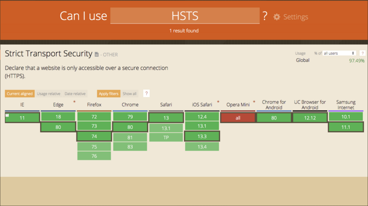
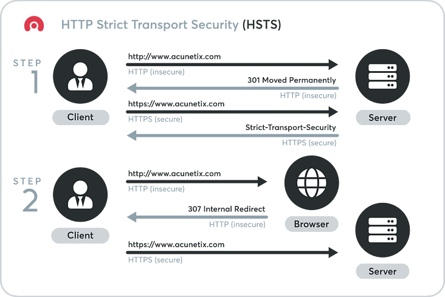
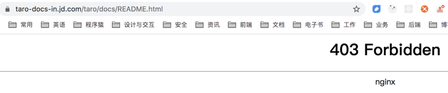
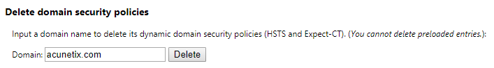
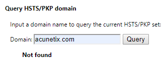

> 翻译自：[What Is HSTS and Why Should I Use It?](https://www.acunetix.com/blog/articles/what-is-hsts-why-use-it/)  
> 作者：[Tomasz Andrzej Nidecki](https://www.linkedin.com/in/tonid?originalSubdomain=mt) ，一位非常专业的 Technical Content Writer ，目前是 [Acunetix](https://www.acunetix.com/) 的技术内容撰写人，他是一名拥有 25 年 IT 经验的记者、翻译和技术撰稿人，Tomasz 早年曾担任《 hakin9 IT Security 》杂志的总编辑，并曾经运营过一个专门针对电子邮件安全的主要技术博客。

HSTS 是 HTTP 严格传输安全（HTTP Strict Transport Security） 的缩写。 这是一种网站用来声明他们的网站只能使用安全连接（HTTPS）访问的方法。 如果一个网站声明了 HSTS 策略，浏览器必须拒绝所有的 HTTP 连接并阻止用户接受不安全的 SSL 证书。 目前大多数主流浏览器都支持 HSTS (只有一些移动浏览器无法使用它)。

在 2012 年的 [RFC 6797](https://tools.ietf.org/html/rfc6797) 中，HTTP严格传输安全被定义为网络安全标准。 创建这个标准的主要目的，是为了避免用户遭受使用 SSL stripping（剥离） 的 [中间人攻击（man-in-The-middle，MITM）](https://www.acunetix.com/blog/articles/man-in-the-middle-attacks/) 。 SSL stripping 是一种攻击者强迫浏览器使用 HTTP 协议连接到站点的技术，这样他们就可以嗅探数据包，拦截或修改敏感信息。 另外，HSTS 也是一个很好的保护自己免受 cookie 劫持（cookie hijacking）的方法。

## HSTS 工作原理
通常，当您在 Web 浏览器中输入 URL 时，您会跳过协议部分。 例如，你输入的是 `www.acunetix.com`，而不是 `http://www.acunetix.com`。 在这种情况下，浏览器假设你想使用 HTTP 协议，所以它在这个阶段发出一个 [HTTP 请求](https://www.acunetix.com/blog/articles/http-security-introduction-to-http-part-1/) 到 `www.acunetix.com`，同时，Web Server 会返回 301 状态码将请求重定向到 HTTPS 站点。 接下来浏览器使用 HTTPS 连接到 `www.acunetix.com`。 这时 HSTS 安全策略保护开始使用 HTTP 响应头：

> Strict-Transport-Security: max-age=31536000; includeSubDomains; preload

响应头的 `Strict-Transport-Security` 给浏览器提供了详细的说明。 从现在开始，每个连接到该网站及其子域的下一年（31536000秒）从这个头被接收的时刻起必须是一个 HTTPS 连接。 HTTP 连接是完全不允许的。 **如果浏览器接收到使用 HTTP 加载资源的请求，则必须尝试使用 HTTPS 请求替代。 如果 HTTPS 不可用，则必须直接终止连接。**

此外，如果证书无效，将阻止你建立连接。 通常来说，如果 HTTPS 证书无效（如：过期、自签名、由未知 CA 签名等），浏览器会显示一个可以规避的警告。 **但是，如果站点有 HSTS，浏览器就不会让你绕过警告。 若要访问该站点，必须从浏览器内的 HSTS 列表中删除该站点**。

响应头的 `Strict-Transport-Security` 是针对一个特定的网站发送的，并且覆盖一个特定的域名（domain）。 因此，如果你有 HSTS 的 `www.acunetix.com` ，它不会覆盖 `acunetix.com`，而只覆盖 `www` 子域名。 这就是为什么，为了完全的保护，你的网站应该包含一个对 base domain 的调用（在本例中是 `acunetix.com`） ，并且接收该域名的 `Strict-Transport-Security` 头和 `includeSubDomains` 指令。

## HSTS 是否完全安全？
不幸的是，你第一次访问这个网站，你不受 HSTS 的保护。 如果网站向 HTTP 连接添加 HSTS 头，则该报头将被忽略。 这是因为攻击者可以在中间人攻击（man-in-the-middle attack）中删除或添加头部。 HSTS 报头不可信，除非它是通过 HTTPS 传递的。

你还应该知道，每次您的浏览器读取 header 时，HSTS `max-age` 都会刷新，最大值为两年。 这意味着保护是永久性的，只要两次访问之间不超过两年。 如果你两年没有访问一个网站，它会被视为一个新网站。 与此同时，如果你提供 `Strict-Transport-Security: max-age=0` 的 HSTS header，浏览器将在下一次连接尝试时将该站点视为一个新站点（这对测试非常有用）。

你可以使用称为 HSTS 预加载列表（HSTS preload list）的附加保护方法。 **Chromium 项目维护一个使用 HSTS 的网站列表，该列表通过浏览器发布**。 如果你把你的网站添加到预加载列表中，浏览器会首先检查内部列表，这样你的网站就永远不会通过 HTTP 访问，甚至在第一次连接尝试时也不会。 这个方法不是 HSTS 标准的一部分，但是它被所有主流浏览器(Chrome、 Firefox、 Safari、 Opera、 IE11 和 Edge)使用。

目前唯一可用于绕过 HSTS 的已知方法是基于 NTP 的攻击。 如果客户端计算机容易受到 [NTP 攻击（ NTP-based attack）](https://www.blackhat.com/docs/eu-14/materials/eu-14-Selvi-Bypassing-HTTP-Strict-Transport-Security.pdf) ，它可能会被欺骗，使 HSTS 策略到期，并使用 HTTP 访问站点一次。

## 如何将域名添加到 HSTS 预加载列表？
要将域添加到 HSTS 预加载列表，该域的站点必须满足几个要求。 以下是添加域名所需的步骤：

1. 确保你的网站拥有有效的证书和最新的密码
2. 如果你的网站可以通过 HTTP 访问，请将所有请求重定向到 HTTPS
3. 确保以上第 1 点和第 2 点适用于你的所有域名和子域名（根据您的 DNS 记录）
4. 通过 HTTPS 服务返回 `Strict-Transport-Security header` ，带上 `base domain` 和 `max-age` ，`max-age` 至少为31536000 (1 年)，另外还有 `includeSubDomains` 指令和 `preload` 指令。 可以参考上面的 HSTS header。
5. 访问 hstspreload.org ，并使用表格提交你的域名。如果符合条件，您的域名将被加入队列。

为了提高安全性，浏览器不能访问或下载 预加载列表（preload list）。 它作为硬编码资源（hard-coded resource）和新的浏览器版本一起分发。 这意味着结果出现在列表中需要相当长的时间，而域从列表中删除也需要相当长的时间。 **如果你希望将你的站点添加到列表中，则必须确保您能够在较长时间内保持对所有资源的完全 HTTPS 访问。 如果不这样做，你的网站可能会完全无法访问**。

就像这样：

## 如何从浏览器的 HSTS 缓存中删除域？
在设置 HSTS 并测试它时，可能需要清除浏览器中的 HSTS 缓存。 如果你设置 HSTS 不正确，你可能会访问网站出错，除非你清除数据。 下面是几种常用浏览器的方法。 还要注意，如果你的域在 HSTS 预加载列表中，清除 HSTS 缓存将是无效的，并且无法强制进行 HTTP 连接。

要从 Chrome HSTS 缓存中删除一个域名，请按照以下步骤操作：

1. 访问 `chrome://net-internals/#hsts`
2. 在 `Delete domain security policies`下的文本框中输入要删除的域
3. 点击文本框旁边的 Delete 按钮

之后，你可以检查移除是否成功：

在 `Query HSTS/PKP domain` 下的文本框中输入要验证的域
点击文本框旁边的 Query 按钮
返回应该是 not found

Mozilla Firefox 、Safari 和 Microsoft Edge 自行查看原文吧。

原作者姓名：[Pines_Cheng](https://segmentfault.com/u/pines_cheng)

原出处：[segmentfault](https://segmentfault.com/)

原文链接：https://segmentfault.com/a/1190000022316260

> Created at 2021-06-25 by Jhail.

