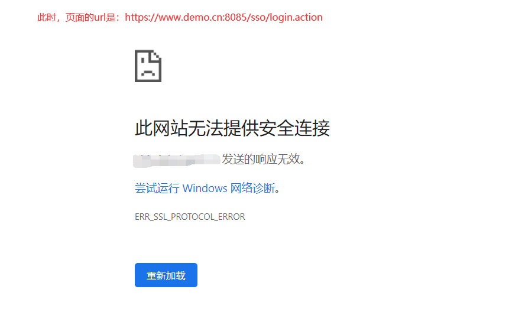
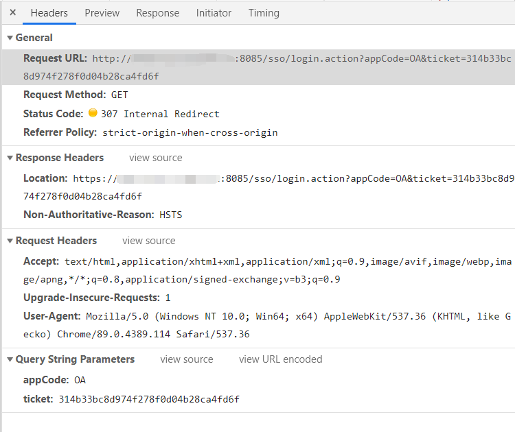

# 一个a标签引发的黑锅与解决过程

## 事件背景
最近在做项目的过程中，需要集成第三方的SSO和OA系统（考虑保密原因，仅用示例域名），就是加个链接先跳转到SSO系统，SSO系统验证权限通过后，再重定向到OA的系统。这还不简单，于是我就写了这样一个a标签：
> `<a href="http://www.project.cn:8085/sso/login.action?appCode=OA&ticket=314b33bc8d974f278f0d04b28ca4fd6f" target="_blank">OA办公</a>`  
> 注：这个SSO系统的服务只支持http协议，不支持https协议  
> 项目地址：`https://www.project.cn`  
> SSO系统地址：`http://www.project.cn:8085/sso/login.action`  
> OA系统地址： `https://oa.project.cn`

可没过几天，项目经理来找我说问题。  
项目经理：你这个链接加的有问题，点击链接时，页面的路径会自动变成 `https://www.project.cn:8085/sso/login.action?appCode=OA&ticket=314b33bc8d974f278f0d04b28ca4fd6f` ，导致请求失败。

此时的我用无辜的语气说：我就仅仅加了个a标签啊，这个跳转应该是服务内部自己处理的吧...  
项目经理说了句我无法反驳的话：之前其它项目往SSO系统跳转都没有问题的，就是从你这个项目中跳转就会这样...  
此时的我一脸不服：是不是SSO系统的服务最近改了？  
项目经理一脸确定的说：没有！  
我突然有点找不到能说服我自己的理由了（虽然我其实是有点不相信他说的服务没改的话，更不会相信我就只加个a标签，还能是我的问题吗），所以也就只能跟项目经理说，那我排查下...  

## 排查过程
既然要排查，那就顺藤摸瓜吧，先找到源头...

- step1: 我开始以为是服务本身的原因，所以我肯定先测试看OA系统有没有问题，很简单，直接输入`http://www.project.cn:8085/sso/login.action?appCode=OA&ticket=314b33bc8d974f278f0d04b28ca4fd6f` 看看能不能访问。

    1. 直接输入，发现同样会跳转到`https://www.project.cn:8085/sso/login.action?appCode=OA&ticket=314b33bc8d974f278f0d04b28ca4fd6f`, 内心一阵窃喜...  
    2. 本着严谨的态度，清除了浏览器的缓存，再刷新，Oh my god! 竟然进入OA系统了，之后再怎么尝试都可以进入OA系统...（OA系统的url是`https://oa.project.cn`）
    3. 再点击我们系统中的链接跳转试试，咦，可以访问了
    4. 再刷新我们的系统，再点击，又不行了，又跳转到 `https://www.project.cn:8085/sso/login.action?appCode=OA&ticket=314b33bc8d974f278f0d04b28ca4fd6f` 这个地址了，之后怎么点击都会跳转
    
- step2：那找下跳转的原因吧，看看是不是服务端返回了 `301` `302`之类的HTTP状态码。咦？怎么`Status Code`是`307`，这个`307`涉及到我的知识盲区了哎，赶紧查下...原来，对于GET请求来说，`307`和`302`、`303`一样，都是临时重定向。


    1. 发现响应头中有个从来没见过的字段 `Non-Authoritative-Reason: HSTS`,经过查询得知，[HSTS](./HSTS.md) 是一种策略，这是一种网站用来声明他们的网站只能使用安全连接（HTTPS）访问的方法。
    
        HSTS 安全策略保护通常使用的 HTTP 响应头：  
        `Strict-Transport-Security: max-age=31536000; includeSubDomains; preload`
    
- step3: 我们的服务端和nginx里面从来没有设置过 `Strict-Transport-Security` 这个响应头，那这个响应头是哪里设置的呢？
    
    1. 先在我们项目的请求列表里随机点了一些请求查看 `Response Headers`，没有找到`Strict-Transport-Security`，又在SSO系统里找了一些，也没有找到；
    2. 不经意间在OA系统里发现每个响应头中都带有`Strict-Transport-Security`，但是这个系统是重定向过来的，怎么会影响之前的系统呢？经排查发现，项目中有个接口是通过`nginx`转发到OA系统，获取到OA系统的待办列表，于是很自然而然的返回了`Strict-Transport-Security` 这个响应头，导致设置了`www.project.cn`这个域名必须要在`https`协议下请求。
    
- step4: 解决方案
    1. 设置`nginx`转发配置
        ```nginx
            location /proxy {
                proxy_pass  https://oa.project.cn;
       
                # 过滤 https://oa.project.cn Response Headers 中的  Strict-Transport-Security 
                proxy_hide_header Strict-Transport-Security;
            }
        ```
    2. 考虑到之前的系统可能已经被设置了`Strict-Transport-Security: max-age=31536000; includeSubDomains; preload`，需要手动清除缓存。为了避免用户需要清除缓存的麻烦，我们自己设置下`Strict-Transport-Security`
        ```nginx
            location /proxy {
                proxy_pass  https://oa.project.cn;
       
                # 过滤 https://oa.project.cn Response Headers 中的  Strict-Transport-Security 
                proxy_hide_header Strict-Transport-Security;
       
                # 设置 Strict-Transport-Security 的有效期为 0
                add_header Strict-Transport-Security max-age=0;
            }
        ```
    
- step5: 经测试，问题得到解决。


> 附录：
> 在http 1.1规范中，307为临时重定向，如果重定向307的原请求不是get或者head方法，那么浏览器一定不能自动的进行重定向，即便location有url，也应该忽略。
