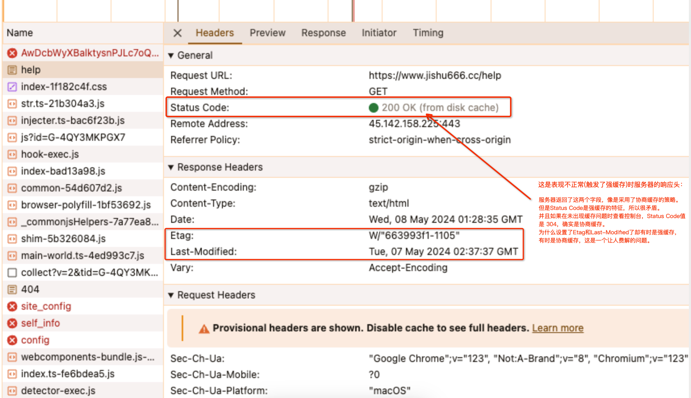
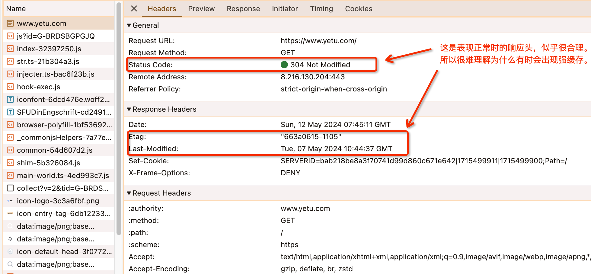

# 技术复盘：深度解析部署后“需手动刷新”的 HTTP 缓存顽疾

## 0. 背景：挥之不去的“刷新”魔咒

在我们的 Web 项目中，一直存在一个令人头疼的现象：**项目部署上线后，偶现用户无法第一时间看到更新，必须手动执行“强制刷新”才能恢复正常。**

由于该问题表现为偶发性、无规律，且难以稳定复现，长期以来它的优先级一直被搁置。然而，作为一个前端开发者，我深知这种“玄学问题”背后一定隐藏着明确的底层逻辑。本周，终于在我的本地环境成功“抓”到了这个 Bug，于是我决定顺藤摸瓜，彻底终结这个顽疾。

---

## 1. 现象观察：混乱的响应头

通过拦截复现时的网络请求，我对比了两种不同的服务器响应情况：

### 情况 A：莫名其妙的“强缓存”

即使是刚部署不久的资源，浏览器竟然直接从本地获取了缓存，状态码为 `200 (from cache)`。



### 情况 B：正常的“协商缓存”

有时又能正常发起请求，并返回 `304 Not Modified`。



**疑问点：** 为什么在完全没有设置 `Cache-Control` 或 `Expires` 的情况下，浏览器会自动表现出“强缓存”的行为？

---

## 2. 核心线索：消失的 Cache-Control 与 启发式缓存

在排查过程中，我发现我们的 Nginx 配置中对入口 HTML 文件确实漏掉了显式的缓存控制策略。

但在深入研究 HTTP 协议规范时，我发现了一个关键概念：**启发式缓存 (Heuristic Caching)**。

### 什么是启发式缓存？

根据 [RFC 7234](https://tools.ietf.org/html/rfc7234#section-4.2.2)，如果一个响应中：

1. 没有显式设置 `Cache-Control: max-age` 或 `Expires`。
2. 但是设置了 `Last-Modified`（最后修改时间）。

**那么浏览器会启动一个自作聪明的算法：** 它会根据 `Date` 和 `Last-Modified` 之间的时间差，自动算出一个缓存有效期（通常是差值的 10%）。

**这就是根源：**
由于我们的响应头里有 `Last-Modified`（由服务器自动生成），但没有 `Cache-Control`，浏览器便“好心”地为我们开启了强缓存。当初部署间隔越久，浏览器算出的强缓存时长就越长，导致用户在部署后依然死死抱着旧资源不放。

---

## 3. 彻底解决方案

定位到原因后，解决思路非常明确：**必须显式剥夺浏览器的“猜测权”。**

### 优化措施：

在服务器端（如 Nginx）针对入口文件（如 `index.html`）设置如下响应头：

```nginx
# 强制使用协商缓存
add_header Cache-Control "no-cache";
```

### 为什么是 no-cache？

- `no-cache` 的含义并非“不缓存”，而是**“不直接使用本地缓存”**。
- 它强制浏览器每次请求前都必须向服务器发起验证（即协商缓存）。
- 如果服务器端的 HTML 没变，返回 304（极快）；如果变了，返回 200。这样既利用了缓存提升性能，又百分之百保证了版本更新的实时性。

---

## 4. 总结与启示

HTTP 缓存是一个精密且复杂的系统，任何一个“默认配置”的缺失都可能引入浏览器厂商自定义的行为对冲。

1. **不要相信浏览器的默认行为**：在生产环境中，核心静态资源（尤其是入口文件）必须有明确的缓存管理策略。
2. **区分概念**：搞清楚 `no-cache`（强制协商）与 `no-store`（完全禁用）的区别，并根据业务场景选择最佳实践。
3. **重视 Last-Modified**：在缺失 Cache-Control 时，它就是触发启发式缓存的元凶。

通过这次复盘，我们不仅解决了项目中的疑难杂症，也再一次通过实战验证了 HTTP 规范的重要性。

---

> [!TIP]
> **最佳实践建议**：
>
> - `index.html`：`Cache-Control: no-cache`
> - `static/js, css`（带有哈希的文件）：`Cache-Control: max-age=31536000` (强缓存 1 年)
