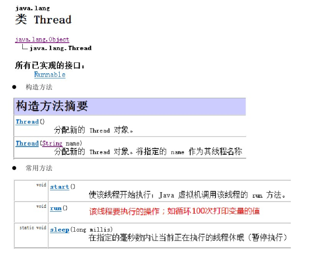
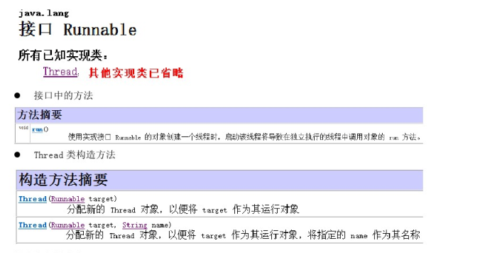

---

---

# 多线程学习


## 1. 多线程简介

### 1.1 区分线程和进程

- 进程：指正在运行的程序。确切来说，当一个程序进入内存运行，即变成一个进程，进程是处于运行过程中的程序，并且具有一定独立功能。
- 线程：线程是进程中的一个执行单元，负责当前进程中程序的执行，一个进程中至少有一个线程。一个进程中是可以有多个线程的，这个应用程序也可以称之为多线程程序。

### 1.2 多线程介绍  

​	*线程*是程序中执行的线程。

​	Java虚拟机允许应用程序同时运行多个执行线程。

​	每个线程都有优先权。 具有较高优先级的线程优先于具有较低优先级的线程执行。  每个线程可能也可能不会被标记为守护进程。  当在某个线程中运行的代码创建一个新的`Thread`对象时，新线程的优先级最初设置为等于创建线程的优先级，并且当且仅当创建线程是守护进程时才是守护进程线程。  

​	当Java虚拟机启动时，通常会有一个非守护进程线程（通常调用某个指定类的名为`main`的方法）。  Java虚拟机继续执行线程，直到发生以下任一情况： 

- 已调用类`Runtime`的`exit`方法，并且安全管理器已允许进行退出操作。  
- 所有非守护程序线程的线程都已死亡，无论是通过调用`run`方法返回还是抛出超出`run`方法传播的异常。  

### 1.3 程序运行原理

- 分时调度

  所有线程轮流使用 CPU 的使用权，平均分配每个线程占用 CPU 的时间。

- 抢占式调度

  优先让优先级高的线程使用 CPU，如果线程的优先级相同，那么会随机选择一个（线程随机性），Java使用的为抢占式调度。

#### 1.3.1 抢占式调度细节

​	大部分操作系统都支持多进程并发运行，现在的操作系统几乎都支持同时运行多个程序。

​	实际上，CPU使用抢占式调度模式在多个线程间进行着高速的切换。对于CPU的一个核而言，某个时刻，只能执行一个线程，而CPU在多个线程间切换速度相对我们的感觉要快，感觉上就是在同时运行。

​	其实，多线程程序并不能提高程序的运行速度，但能够提高程序的运行效率，让CPU的使用率更高。

### 1.4 主线程

​	当在dos命令行中输入 java Xxx(某个类名)，启动JVM，并且加载对应的Xxx.class文件。虚拟机会从main方法开始执行我们的程序代码直到结束。如果在执行过程遇到循环时间比较长的代码，那么在循环之后的其他代码是不会被马上执行的。如下：

```java
class Demo {
    String name;
    Demo (String name) {
        this.name = name;
    }
    void show () {
        for (int i = 1; i < 10000; i++) {
            System.out.println("name=" + name + ", i=" + i);
        }
    }
}

class ThreadDemo {
    public static void main (String[] args) {
        Demo d = new Demo("小强")；
        Demo d2 = new Demo("小明")；
        d.show();
        d2.show();
        System.out.println("Hello World!");
    }
}
```

​	若在上述代码中 show 方法中的循环执行次数很多，这时在*d.show();*下面的代码是不会马上执行的，并且在dos窗口会看到不停的输出name=小强，i=\d这样的语句。为什么会这样呢 ？

​	原因是：`JVM启动后，必然有一个执行路径（线程）从main方法开始的，一直执行到main方法结束，这个线程在java中称之为主线程（main线程）。`当程序的主线程执行时，如果遇到了循环而导致程序在某个位置停留时间过长，则无法马上执行下面的程序，需要等待循环结束后方能够执行。

​	那么，能否实现一个主线程负责执行其中一个循环，再由另一个线程负责其它代码的执行，最终实现多部分代码同时执行的效果？

​	能够实现同时执行。通过Java中的多线程技术来解决该问题。

### 1.5 Thread 类

​	Thread是程序中的执行线程。Java虚拟机允许应用程序并发地运行多个执行程序。



有两种方法可以创建新的执行线程。 

- 一是声明一个类是`Thread`的子类。  此子类应覆盖类`Thread`的`run`方法。  然后可以分配和启动子类的实例。
- 二是声明一个实现`Runnable`接口的类。  该类然后实现`run`方法。  然后可以分配类的实例，在创建`Thread`时作为参数传递，然后启动。

​	每个线程都有一个用于识别目的的名称。 多个线程可能具有相同的名称。  如果在创建线程时未指定名称，则会为其生成新名称。

### 1.6 创建线程方式——继承 **Thread **类

​	创建线程的步骤：

  1. 定义一个类继承Thread。

  2. 重写run方法。

  3. 创建子类对象（也就是创建线程对象）。

  4. 调用start方法，开启线程并让线程执行，同时还会告诉JVM去调用run方法。

     代码演示如下：

```java
/**
 * 自定义线程类 MyThread
 */ 
public class MyThread extends Thread {
    // 定义指定线程名称的构造方法
    public MyThread(String name) {
        // 调用父类的 String 参数的构造方法，指定线程的名称
        super(name);
    }
    // 重写 run 方法，完成该线程执行的逻辑
    @Override
    public void run () {
        for (int i = 0; i < 10; i++) {
            System.out.println(getName() + "：正在执行！" + i);
        }
    }
}
```
```java

/**
 * 测试类
 */
public class Test01 {
    public static void main(String[] args) {
        // 创建自定义线程对象
        MyThread mt = new MyThread("新的线程");
        // 开启新线程
        mt.start();
        
        // 在主线程中执行for循环
        for (int i = 0; i < 10; i++) {
            System.out.println("main线程！" + i);
        }
    }
}
```

​	思考：线程对象调用 run 方法和调用 start 方法的区别？

​	线程对象调用 run 方法仅仅是对象调用方法，不会开启新线程。线程对象调用 start 方法会开启线程，并让 JVM 在开启的新线程中执行 run 方法。

#### 1.6.1 继承 Thread 类原理

​	为什么要继承 Thread 类并调用其 start 方法才能开启线程呢？

​	继承 Thread 类：因为 Thread 类用来描述线程，具备线程应该有的功能。那为什么不直接创建 Thread 类的对象呢？如下代码：

```java
Thread t1 = new Thread();
t1.start();
// 这样做没有错，但是该start调用的是Thread类中的run方法，而这个run方法没有做什么事情，更重要的是这个run方法中并没有定义我们需要让线程执行的代码。
```

​	创建线程的目的是什么？

​	是为了建立程序单独的执行路径，让多部分代码实现同时执行。也就是说线程创建并执行需要给定线程要执行的任务。

​	对于主线程而言，它的任务定义在main函数中。自定义线程需要执行的任务都定义在run方法中。

​	Thread 类run方法中的任务并不是我们所需要的，只有重写这个run方法。既然Thread类已经定义了线程任务的编写位置（run方法)，那么只要在编写位置（run方法）中定义任务代码即可。所以进行了重写run方法的动作。

#### 1.6.2 获取线程名称

​	开启的线程都会有自己的独立的运行栈内存，那么这些运行的线程的名字是什么呢？

| 类 Thread |                                  |
| -----: | -------------------------------- |
|  static Thread  | currentThread() <br /> 	                返回对当前正在执行的线程对象的引用 |
|  String  |  getName() 	返回该线程的名称。 |

 - Thread.currentThread(); 获取当前线程对象

 - Thread.currentThread().getName(); 获取当前线程对象的名称

```java
class MyThread extends Thread { // 继承Thread
    MyThread () {
        super();
    }
    MyThread (String name) {
        super(name);
    }
    // 复写其中的run方法
    public void run () {
        for (int i = 1; i < 3; i++) {
            System.out.println(Thread.currentThread().getName() + ",i=" + i);
        }
    }
}

class ThreadDemo {
    public static void main(String[] args) {
        // 创建两个线程任务
        MyThread d = new MyThread();
        MyThread d2 = new MyThread();
        d.run(); // 没有开启新线程，在主线程里调用run方法
        d2.start(); // 开启了一个新线程，新线程调用run方法
    }
}
/**
 * 控制台输出为：
 * main,i=1
 * main,i=2
 * Thread-1,i=1
 * Thread-2,i=1
 * Thread-1,i=2
 * Thread-2,i=2
 * 无 Thread-0 的原因是局部变量d所指向的线程未开启，故控制台未打印该线程名称。
 */
```

​	通过结果观察，主线程的名称：main；自定义的线程：Thread-0，线程多个时，数字顺延。

如：Thread-0，Thread-1，Thread-2，Thread-3 ......

### 1.7 创建线程方式 —— 实现 Runnable 接口

​	该方式创建线程的步骤：

1. 定义一个类实现 Runnable 接口。
2. 重写接口中的 run 方法。
3. 创建 Runnable 的子类对象。
4. 传入到某个线程的构造函数中。
5. 调用Thread类的start方法开启线程。

​	Runnable 接口用来指定每个线程要执行的任务。包含了一个 run 的无参数抽象方法，需要由接口实现类重写该方法。



​	代码演示如下：

```java
/**
 * 自定义线程执行任务类
 */
public class MyRunnable implements Runnable {
    // 定义线程要执行的 run 方法逻辑
    @Override
    public void run () {
        System.out.println("我的线程：正在执行！" + i);
    }
}
```

```java
/**
 * 测试类
 */
public class Test02 {
    public static void main(String[] args) {
    	// 创建线程执行目标类对象
    	Runnable r = new MyRunnable();
        // 将 Runnable 接口的子类对象作为参数传递给Thread类的构造函数
        Thread thread = new Thread(r);
        Thread thread2 = new Thread(r);
        // 开启线程
        thread.start();
        thread2.start();
        for (int i = 0; i < 10; i++) {
            System.out.println("main线程：正在执行！" + i);
        }
    }
    
    public void run () {
        System.out.println("我的线程：正在执行！" + i);
    }
}
```

#### 1.7.1 实现 Runnable 的原理

​	为什么需要定义一个类去实现 Runnable 接口呢？继承 Thread 类和实现 Runnable 接口有啥区别呢？

​	实现 Runnable 接口，避免了继承 Thread 类的单继承局限性。覆盖 Runnable 接口中的 run 方法，将线程任务代码定义到 run 方法中。

​	创建 Thread 类的对象，只有创建 Thread 类的对象才可以创建线程。线程任务已被封装到 Runnable 接口的 run 方法中，而这个 run 方法所属于 Runnable 接口的子类对象，所以将这个子类对象作为参数传递给 Thread 的构造函数。这样，线程对象创建时就可以明确要运行的线程的任务。

#### 1.7.2 实现 Runnable 的好处

​	实现 Runnable 接口避免了单继承的局限性，所以较为常用。实现 Runnable 接口的方式，更加符合面向对象的思想。线程分为两部分，一部分线程对象，一部分线程任务。

​	通过继承 Thread 类的方式，线程对象和线程任务耦合在一起。一旦创建 Thread 类的子类对象，既是线程对象，又有线程任务。

​	实现 Runnable 接口，将线程任务单独分离出来封装成对象，类型就是 Runnable 接口类型。Runnable 接口对线程对象和线程任务进行解耦。

### 1.8 线程的匿名内部类使用

​	使用线程的匿名内部类方式，可以方便的实现每个线程执行不同的线程任务操作。

- 方式一：创建线程对象时，直接重写Thread 类中的 run 方法

```java
new Thread() {
    public void run() {
        for (int x = 0; x < 10; x++) {
            System.out.println(Thread.currentThread().getName() + "...X..." + x);
        }
    }
}.start();
```


- 方式二：使用匿名内部类的方式实现 Runnable 接口，重写 Runnable 接口中的 run 方法

```java
Runnable r = new Runnable() {
    public void run() {
        for (int x = 0; x < 10; x++) {
            System.out.println(Thread.currentThread().getName() + "...X..." + x);
        }
    }
};
new Thread(r).start();
```


## 2. 线程池

#### 2.1 线程池的概念

​	线程池，其实就是一个容纳多个线程的容器，其中的线程可以反复使用，省区了频繁创建线程对象的操作，无需反复创建线程而消耗过多的资源。

​	为什么要使用线程池？

​	因为在java中，如果每个请求到达就创建一个新线程，开销是相当大的。在实际使用中，创建和销毁线程所花费的实际和消耗的系统资源都相当大，甚至可能要比在处理实际的用户请求的时间和资源要多得多。除了创建和销毁线程的开销之外，活动的线程也需要消耗系统资源。如果在一个jvm里创建太多的线程，可能会使系统由于过度消耗内存或“切换过度”而导致系统资源不足。为了防止资源不足，需要采取一些办法来限制任何给定时刻处理请求的数目，尽可能地减少创建和销毁线程的次数，特别是一些资源耗费比较大的线程的创建和销毁，尽量利用已有对象来进行服务。

​	线程池主要用来解决线程生命周期开销问题和资源不足问题。通过对多个任务重复使用线程，线程创建的开销就被分摊到了多个任务上了，而且由于在请求到达时线程已经存在，所以消除了线程创建所带来的延迟。这样，就可以立即为请求服务，使应用程序响应更快。另外，通过适当的调整线程中的线程数目可以防止出现资源不足的情况。

#### 2.2 使用线程池方式——Runnable 接口

​	通常，线程池都是通过线程池工厂创建，再调用线程池中的方法获取线程，再通过线程去执行任务方法。

- `Executors： 线程池创建工厂类`

  - public static ExectorService newFixedThreadPool(int nThreads): 返回线程池对象

- `ExecutorService： 线程池类`

  - Future<?> submit(Runnable task): 提交一个可运行的任务执行，并返回一个表示该任务的未来。

- `Future接口： 用来记录线程任务执行完毕后产生的结果`

  - V  get()  等待计算完成，然后检索其结果。

  - 提供方法来检查计算是否完成，等待其完成，并检索计算结果。 结果只能在计算完成后使用方法get进行检索，如有必要，阻塞，直到准备就绪。

  使用线程池中线程对象的步骤：

  - 创建线程池对象
  - 创建Runnable接口子类对象
  - 提交Runnable接口子类对象
  - 关闭线程池

  代码演示：

```java
public class ThreadPoolDemo {
    public static void main(String[] args) {
        // 创建线程池对象
        ExecutorService service = Executors.newFixedThreadPool(2); // 包含2个线程
        
        // 创建 Runnable 实例对象
        MyRunnable mr = new MyRunnable();
        
        // 提交一个可运行的任务
        service.submit(mr); // 从线程池中获取线程对象，然后调用 MyRunnable 中的 run()
        // 再提交一个可运行的任务
        service.submit(mr);
        // 注意：submit方法调用结束后，程序并不终止，是以为线程池控制了线程的关闭。将使用完的线程又归还到了线程池中
        // 关闭线程池
        // service.shutdown();
    }
}
```

```java
public class MyRunnable implements Runnable {
    @Override
    public void run() {
        System.out.println("balabala wait...");
        
        try {
            Thread.sleep(2000);
        } catch (InterruptedException e) {
            e.printStackTrace();
        }
        System.out.println("balabala coming" + Thread.currentThread().getName());
    }
}
```


#### 2.3 使用线程池方式——Callable接口

​	与 Runnable 的方式类似，以后再详细补充区别。

- `Callable 接口：`与Runnable接口功能相似，用来指定线程的任务。其中的call()方法，用来返回线程任务执行完毕后的结果，call方法可抛出异常。

  	代码演示：

```java
public class ThreadPoolDemo {
    public static void main(String[] args) {
        // 创建线程池对象
        ExecutorService service = Executors.newFixedThreadPool(2); // 包含2个线程
        
        // 创建 Runnable 实例对象
        MyRunnable mr = new MyRunnable();
        
        // 提交一个可运行的任务
        service.submit(mr); // 从线程池中获取线程对象，然后调用 MyRunnable 中的 run()
        // 再提交一个可运行的任务
        service.submit(mr);
        // 注意：submit方法调用结束后，程序并不终止，是以为线程池控制了线程的关闭。将使用完的线程又归还到了线程池中
        // 关闭线程池
        // service.shutdown();
    }
}
```

```java
public class MyCallable implements Callable {
    @Override
    public object call() throws Exception {
        System.out.println("balabala wait...");
        
        Thread.sleep(2000);
        
        System.out.println("balabala coming" + Thread.currentThread().getName());
        return null;
    }
}
```

#### 2.4 线程池案例

后补...