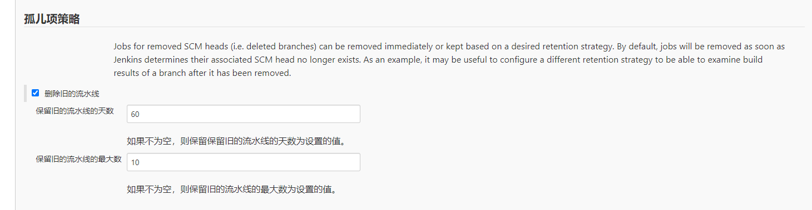

#  在Jenkins中添加多分支流水线任务


## 1. 什么是多分支流水线？

Jenkins多分支流水线(Multibranch Pipeline )项目类型能够在同一个项目的不同分支上实现不同的Jenkinsfile。在多分支流水线项目中, Jenkins 自动的发现、管理和执行在源代码控制中包含Jenkinsfile的分支的流水线，这消除了手动创建和管理流水线的需要。

## 2. 安装 [Generic Webhook Trigger Plugin](https://plugins.jenkins.io/generic-webhook-trigger)

在实际应用中，我们经常需要GitLab+Jenkins实现代码提交触发Job的自动构建。对于普通Job，webhook自动触发即可；但是对于多分支流水线，每次webhook触发的可能是master、dev等所有的包含Jenkinsfile文件的分支的构建，这显然是不符合要求的，将会产生很多垃圾的构建历史，给后期查看构建历史排错带来极大的不便。

因此，我们需要的是webhook按分支触发，这样某个分支提交了代码只触发对应分支的自动构建流水线，避免其他分支产生垃圾构建；

## 3. 创建多分支流水线

### 3.1 **点击Jenkins主页上的 New Item**


### 3.2 配置job

#### 3.2.1 General项

General项可以不填，也可以按需填写，对整体的job影响不大

#### 3.2.2 分支源项


#### 3.2.3 孤儿项策略

该项可以按需填写，对job的执行影响不大，主要影响的是旧的流水线的最大数量和保留天数。



#### 3.2.4 Jenkinsfile

`Jenkinsfile` 是一个文本文件，它包含了 Jenkins 流水线的定义并被检入源代码控制仓库。

也只有项目的源代码仓库的根目录下包含Jenkinsfile文件的分支可以被检测到对应分支的流水线job。

保存job后，点击`立刻Scan多分支流水线`：


然后可以查看`Scan多分支流水线日志`，或者点击状态查看检测到的结果：

演示的项目中包含多个分支，但仅有如下的三个分支中有`Jenkinsfile`文件：


`Jenkinsfile`的初步内容可以用如下来内容进行测试：

```Jenkinsfile
pipeline {
    agent any
	options {
	    timeout(time: 30, unit: 'MINUTES')
	    retry(2)
        timestamps()
    }
    triggers {
        GenericTrigger (
            causeString: 'Triggered by $ref',
            genericVariables: [[key: 'ref', value: '$.ref']],
            printContributedVariables: true,
            printPostContent: true,
            regexpFilterExpression: 'refs/heads/' + BRANCH_NAME,
            regexpFilterText: '$ref',
            token: 'abcdef'
        )
    }
    stages {
    	stage("测试分支") {
          when {
            branch 'test-cicd'
          }
    	    steps {
                echo 'this is the test-cicd branch'
    	    }
    	}
    	stage("测试分支") {
          when {
            branch 'dev'
          }
    	    steps {
                echo 'this is the develop branch'
    	    }
    	}
    	stage("生产分支") {
            when {
                branch 'master'
            }
    	    steps {
                echo 'this is the master branch'
    	    }
    	}
    }
}
```


### 3.3 配置GitLab中的Webhooks

> 注意：项目中`Jenkinsfile`中的`GenericTrigger`配置中的token要和GitLab中Webhooks Settings中的Secret Token相同。
>
> `GenericTrigger`中的其它配置详细可查：[generic-webhook-trigger](https://plugins.jenkins.io/generic-webhook-trigger/)


按图示配置好后点击`Add webhook`按钮保存。

> 解决gitlab添加webhook提示`Url is blocked: Requests to the local network are not allowed`的问题， 参考[解决gitlab添加webhook提示](cicd/fix-gitlab-url-blocked.md)

## 4. 构建NodeJS项目

> 当前前端项目的依赖中经常吃会需要node-gyp这个依赖用来编译原生的C++模块，所以在`npm install`时如果遇到node-gyp相关的错误时，需要在CentOS中安装如下环境，执行：
>
> ```yum -y install gcc gcc-c++ automake autoconf libtool make```

修改`Jenkinsfile`：

```jenkinsfile
pipeline {
    agent any
	options {
	    timeout(time: 30, unit: 'MINUTES')
	    retry(2)
        timestamps()
    }
    triggers {
        GenericTrigger (
            causeString: 'Triggered by $ref',
            genericVariables: [[key: 'ref', value: '$.ref']],
            printContributedVariables: true,
            printPostContent: true,
            regexpFilterExpression: 'refs/heads/' + BRANCH_NAME,
            regexpFilterText: '$ref',
            token: 'abcdef'
        )
    }
    stages {
    	stage("environment") {
    	    steps {
    	        nodejs("node12.18.2") {
                	sh 'node -v'
                	sh 'npm -v'
                	sh 'npm config ls'
                	sh 'npm install'
    	        }
          }
    	}
    }
}
```

## 5. 使用Jenkins平台自带的工具安装Node


## 6. 构建Docker镜像

> 解决报错`Error response from daemon: client version 1.40 is too new. Maximum supported API version is 1.39`， 参考[docker常见问题归纳.md](cicd/docker/docker常见问题归纳?id=_2-error-response-from-daemon-client-version-140-is-too-new-maximum-supported-api-version-is-139)

## 7. 

## 5. 集成`DingTalk`插件实现钉钉消息推送项目的构建状态

1. 在Jenkins中安装[`DingTalk`](https://plugins.jenkins.io/dingding-notifications/)插件，安装后重启

	> [钉钉机器人插件文档](https://jenkinsci.github.io/dingtalk-plugin/)

	

2. 从系统配置设置钉钉的基本信息

	

3. 新建一个钉钉群，添加机器人,选择自定义

  

  

  这里选择自定义关键词，添加关键词，点击完成，加签和IP地址的方式可以自行研究。

  

  


