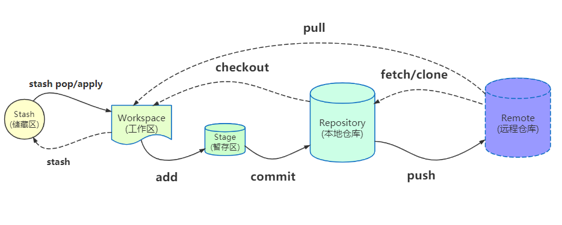

# Git Summary

> git的特性及与svn的区别
>
> git中工作区
>
> 常用命令
>
> 分支及merge
>
> 其它：1: 常用的git工具

1. 常用的git命令

2. git branch

3. git workflow

4. .gitignore

5. git三板斧

6. git fetch

7. `git stash` 是程序员的至宝

   > 老板 biangbiang 甩来一个 case，说这个要下班之前 hot fix，咋办，stash，切到 release 对应的分支，缝缝补补；产品 kuangkuang 砸来一个需求更新，说这个简单，小哥哥帮帮我先做了，咋办，stash 切一个新的 feature 分支，撸袖子干。如果没有 `git stash`，人生至少要灰暗一半。

8. 查看当前状态 *git* status

9. 不在跟踪已经提交过的文件，用什么命令？

10. 只要commit过的内容，就都可以找回

11. rebase

12. 只合并某个分支的个别文件

13. 只合并某次提交内容


>  因为时间有限，所以这次分享主要以能快速上手git，能应对常见场景的使用需求为目的。对于有基础的小伙伴来说可能不够深入，如果有想讨论的，可以随时提出来。
>
>  在坐的这么多同事，我相信肯定有一些人的git用的很好的，所以如果发现我讲错了，要及时纠正，千万不能因为我的理解偏差把大伙带偏了。如果有某方面没涉及到或者没讲清楚的，及时提出来，可以深入沟通。
>
>  时间有限，我把我工作中感觉重要的命令和场景跟大家分享下。

## 1.SVN与Git的最主要的区别？

SVN是集中式版本控制系统，版本库是集中放在中央服务器的，而干活的时候，用的都是自己的电脑，所以首先要从中央服务器哪里得到最新的版本，然后干活，干完后，需要把自己做完的活推送到中央服务器。~~集中式版本控制系统的中央服务器是必须的，而且是必须联网才能工作，如果在局域网还可以，带宽够大，速度够快，如果在互联网下，如果网速慢的话，就纳闷了。~~

Git是分布式版本控制系统，那么它就可以是没有中央服务器的（为了团队间协作方便，通常也会有中央服务器），每个人的电脑就是一个完整的版本库，这样，工作的时候就不需要联网了，因为版本都是在自己的电脑上。既然每个人的电脑都有一个完整的版本库，那多个人如何协作呢？~~比如说自己在电脑上改了文件A，其他人也在电脑上改了文件A，这时，你们两之间只需把各自的修改推送给对方，就可以互相看到对方的修改了。~~

> Git不需要联网的体现：在中央仓库未建立时即可进行版本控制，这个是svn做不到的。
>
> 那为什么还要加上中央仓库？1. 方便团队协作  2. 代码存储/备份
>
> 当然，Git的优势不单是不必联网这么简单，后面我们还会看到Git极其强大的分支管理，把SVN等远远抛在了后面。
>
> Git的劣势：上手比较难。不适合大文件存储，如镜像文件，大psd等。

## 2. 必须掌握的重要概念

应该是所有的使用过git的人都知道提交代码通常需要最基本的三步：`git add .` `git commit -m "xxx"` `git push/git pull`，那为什么提交个代码要操作三次呢，好像很麻烦的样子？

### 2.1 五个工作区域



- `Workspace`：工作区
- `Index / Stage`：暂存区
- `Repository`：仓库区（或本地仓库）
- `Remote`：远程仓库
- `Stash`：储藏区（Git的存储栈）

### 2.2 工作流程

git的工作流程一般是这样的：

１、在工作目录中添加、修改文件；

２、将需要进行版本管理的文件放入暂存区域；(`git add <file>...`)

３、将暂存区域的文件提交到git本地仓库。(`git commit -m "message..."`)

因此，git管理的文件有三种状态：已修改（modified）,已暂存（staged）,已提交(committed)

### 2.3 文件的四种状态

版本控制就是对文件的版本控制，要对文件进行修改、提交等操作，首先要知道文件当前在什么状态，不然可能会提交了现在还不想提交的文件，或者要提交的文件没提交上。

GIT不关心文件两个版本之间的具体差别，而是关心文件的整体是否有改变，若文件被改变，在添加提交时就生成文件新版本的快照，而判断文件整体是否改变的方法就是用：SHA-1算法计算文件的校验和。


**Untracked:**  未跟踪, 此文件在文件夹中, 但并没有加入到git库, 不参与版本控制. 通过git add 状态变为Staged.

**Unmodify:**  文件已经入库, 未修改, 即版本库中的文件快照内容与文件夹中完全一致. 这种类型的文件有两种去处, 如果它被修改, 而变为Modified.如果使用git rm移出版本库, 则成为Untracked文件

**Modified:** 文件已修改, 仅仅是修改, 并没有进行其他的操作. 这个文件也有两个去处, 通过git add可进入暂存staged状态, 使用git checkout 则丢弃修改过,返回到unmodify状态, 这个git checkout即从库中取出文件, 覆盖当前修改

**Staged:** 暂存状态. 执行git commit则将修改同步到本地仓库中, 这时库中的文件和本地文件又变为一致, 文件为Unmodify状态. 执行git reset HEAD filename取消暂存,文件状态为Modified

> git中的HEAD是什么？

下面的图很好的解释了这四种状态的转变：


新建文件--->Untracked

使用add命令将新建的文件加入到暂存区--->Staged

使用commit命令将暂存区的文件提交到本地仓库--->Unmodified

如果对Unmodified状态的文件进行修改---> modified

如果对Unmodified状态的文件进行remove操作--->Untracked

## 3. Git 常用命令

```
# 查看工作区和暂存区的状态
git status 
# 将工作区的文件提交到暂存区
git add .  
# 提交到本地仓库
git commit -m "本次提交说明"
# add和commit的合并，便捷写法（未追踪的文件无法直接提交到暂存区/本地仓库）
git commit -am "本次提交说明"  
# 将本地分支和远程分支进行关联
git push -u origin branchName 
# 将本地仓库的文件推送到远程分支
git push
# 拉取远程分支的代码
git pull origin branchName 
# 合并分支
git merge branchName 
# 查看本地拥有哪些分支
git branch
# 查看所有分支（包括远程分支和本地分支）
git branch -a 
# 切换分支
git checkout branchName 
# 临时将工作区文件的修改保存至堆栈中
git stash
# 将之前保存至堆栈中的文件取出来
git stash pop
# 查看提交历史
git log
```

## 4. 五个区域常用命令

###   4.1 新建代码库

```
# 在当前目录新建一个Git代码库
 git init
# 新建一个目录，将其初始化为Git代码库
git init [project-name]
# 下载一个项目和它的整个代码历史
git clone [url]
```

### 4.2 查看文件状态

```
#查看所有文件状态
git status
#查看指定文件状态
git status [filename]
```

### 4.3 工作区<-->暂存区

```
# 添加指定文件到暂存区
git add [file1] [file2] ...
# 添加指定目录到暂存区，包括子目录
git add [dir]
# 添加当前目录的所有文件到暂存区
git add .
#只作用于工作区已经跟踪的文件变更
git add -u
#当我们需要删除暂存区或分支上的文件, 同时工作区也不需要这个文件了, 可以使用（⚠️）
git rm file_path
#当我们需要删除暂存区或分支上的文件, 但本地又需要使用, 这个时候直接push那边这个文件就没有，如果push之前重新add那么还是会有。
git rm --cached file_path
#直接加文件名   从暂存区将文件恢复到工作区，如果工作区已经有该文件，则会选择覆盖
#加了【分支名】 +文件名  则表示从分支名为所写的分支名中拉取文件 并覆盖工作区里的文件
git checkout
```

### 4.4 工作区<-->本地仓库

```
#将暂存区的文件提交到本地仓库并添加提交说明
git commit -m '该次提交说明'
# add 和 commit 的合并，便捷写法
# 和 git add -u 命令一样，未跟踪的文件是无法提交上去的
git commit -am "本次提交的说明"
#如果出现:将不必要的文件commit 或者 上次提交觉得是错的  或者 不想改变暂存区内容，只是想调整提交的信息
#移除不必要的添加到暂存区的文件
git reset HEAD 文件名
#去掉上一次的提交（会直接变成add之前状态）   
git reset HEAD^ 
#去掉上一次的提交（变成add之后，commit之前状态） 
git reset --soft  HEAD^ 
```

### 4.5 远程操作

```
# 取回远程仓库的变化，并与本地分支合并
git pull
# 拉取指定的远程分支的代码
git pull origin branchName
# 上传本地指定分支到远程仓库
git push [ origin master[:master]]
# 将本地分支和远程分支进行关联(通常仅在第一次提交时)
git push -u origin branchName
```

### 4.6 工作区<-->储藏区

```
# 将所有未commit的修改保存至堆栈中
git stash 
# 给本次存储加个备注，以防时间久了忘了
git stash save "存储"
# 存储未追踪的文件
git stash -u

# 查看存储记录
git stash list

在 Windows 上和 PowerShell 中，需要加双引号
# 恢复后，stash 记录并不删除
git stash apply "stash@{index}"
# 恢复的同时把 stash 记录也删了
git stash pop "stash@{index}"
# 删除 stash 记录
git stash drop "stash@{index}"
# 删除所有存储的进度
git stash clear
# 查看当前记录中修改了哪些文件
git stash show "stash@{index}"
# 查看当前记录中修改了哪些文件的内容
git stash show -p "stash@{index}" 
```

### 4.7 其它常用命令

```

#初次commit之前，需要配置用户邮箱及用户名，使用以下命令：
git config --global user.email "you@example.com"
git config --global user.name "Your Name"
# 查看本地拥有哪些分支
git branch
# 查看所有分支（包括远程分支和本地分支）
git branch -a 
# 切换分支
git checkout branchName 
# 创建新分支并切换到该新分支
git checkout -b branchName 
# 临时将工作区文件的修改保存至堆栈中
git stash
# 将之前保存至堆栈中的文件取出来
git stash pop


# 显示当前的Git配置
git config --list
# 编辑Git配置文件
git config -e [--global]
#调出Git的帮助文档
git --help
#查看某个具体命令的帮助文档
git +命令 --help
#查看git的版本
git --version
```

## 5. 分支

## 6. Git 命令专题

### add

将工作区的文件添加到暂存区

```git
# 添加指定文件到暂存区（追踪新增的指定文件）
git add [file1] [file2] ...
# 添加指定目录到暂存区，包括子目录
git add [dir]
# 添加当前目录的所有文件到暂存区（追踪所有新增的文件）
git add .
#只作用于工作区已经跟踪的文件的修改和删除
git add -u
# 删除工作区/暂存区的文件
git rm [file1] [file2] ...
# 停止追踪指定文件，但该文件会保留在工作区
git rm --cached [file]
# 改名工作区/暂存区的文件
git mv [file-original] [file-renamed]
```

> **`git add -u`** ：**操作的对象是整个工作区已经跟踪的文件变更，无论当前位于哪个目录下**。仅监控**已经被 add 的文件**（即 **`tracked file`**），它会将被修改的文件（包括文件删除）提交到暂存区。`git add -u` 不会提交新文件（**`untracked file`**）。（**`git add --update`** 的缩写）

### status

```git
# 查看工作区和暂存区的状态
git status 
```

> 建议：操作过程中应该经常执行 `git status` 查看工作区和暂存区的状态，确保执行每步git命令都在按照自己的期望进行。

### commit

```git
# 将暂存区的文件提交到本地仓库并添加提交说明
git commit -m "本次提交的说明"   

# add 和 commit 的合并，便捷写法
# 和 git add -u 命令一样，未跟踪的文件是无法提交上去的
git commit -am "本次提交的说明"  

# 跳过验证继续提交
git commit --no-verify
git commit -n

# 编辑器会弹出上一次提交的信息，可以在这里修改提交信息
git commit --amend
# 修复提交，同时修改提交信息
git commit --amend -m "本次提交的说明"
# 加入 --no-edit 标记会修复提交但不修改提交信息，编辑器不会弹出上一次提交的信息
git commit --amend --no-edit
```

> `git commit --amend` 既可以修改上次提交的文件内容，也可以修改上次提交的说明。会用一个新的 `commit` 更新并替换最近一次提交的 `commit` 。如果暂存区有内容，这个新的 `commit` 会把任何修改内容和上一个 `commit` 的内容结合起来。如果暂存区没有内容，那么这个操作就只会把上次的 `commit` 消息重写一遍。**永远不要修复一个已经推送到公共仓库中的提交，会拒绝推送到仓库**

### push & pull

- 分支推送顺序的写法是 **<来源地>:<目的地>**

```git
# 将本地仓库的文件推送到远程分支
# 如果远程仓库没有这个分支，会新建一个同名的远程分支
# 如果省略远程分支名，则表示两者同名
git push <远程主机名> <本地分支名>:<远程分支名>
git push origin branchname  

# 如果省略本地分支名，则表示删除指定的远程分支
# 因为这等同于推送一个空的本地分支到远程分支。
git push origin :master
# 等同于
git push origin --delete master

# 建立当前分支和远程分支的追踪关系
git push -u origin master
# 如果当前分支与远程分支之间存在追踪关系
# 则可以省略分支和 -u 
git push

# 不管是否存在对应的远程分支，将本地的所有分支都推送到远程主机
git push --all origin

# 拉取所有远程分支到本地镜像仓库中
git pull
# 拉取并合并项目其他人员的一个分支 
git pull origin branchname  
# 等同于 fetch + merge
git fetch origin branchName
git merge origin/branchName

# 如果远程主机的版本比本地版本更新，推送时 Git 会报错，要求先在本地做 git pull 合并差异，然后再推送到远程主机。
```

### branch

```git
# 查看本地分支
git branch | git branch -l 
# 查看远程分支
git branch -r 
# 查看所有分支（本地分支+远程分支）
git branch -a 
# 查看所有分支并带上最新的提交信息
git branch -av 
# 查看本地分支对应的远程分支
git branch -vv 

# 新建分支
# 在别的分支下新建一个分支，新分支会复制当前分支的内容
# 注意：如果当前分支有修改，但是没有提交到仓库，此时修改的内容是不会被复制到新分支的
git branch branchname 
# 切换分支(切换分支时，本地工作区，仓库都会相应切换到对应分支的内容)
git checkout branchname 
# 创建一个 aaa 分支，并切换到该分支 （新建分支和切换分支的简写）
git checkout -b aaa 
# 可以看做是基于 master 分支创建一个 aaa 分支，并切换到该分支
git checkout -b aaa master

# 新建一条空分支（详情请看问题列表）
git checkout --orphan emptyBranchName
git rm -rf . 

# 删除本地分支,会阻止删除包含未合并更改的分支
git brnach -d branchname 
# 强制删除一个本地分支，即使包含未合并更改的分支
git branch -D branchname  
# 删除远程分支
# 推送一个空分支到远程分支，其实就相当于删除远程分支
git push origin  :远程分支名
# 或者
git push origin --delete 远程分支名 

# 修改当前分支名
git branch -m branchname 
```

### merge 三种常用合并方法

```git
# 默认 fast-forward ，HEAD 指针直接指向被合并的分支
git merge 

# 禁止快进式合并
git merge --no-ff 

git merge --squash 
```


- `fast-forward`：会在当前分支的提交历史中添加进被合并分支的提交历史（**得先理解什么时候会发生快速合并，并不是每次 merge 都会发生快速合并**）；
- `--no-ff`：**会生成一个新的提交**，让当前分支的提交历史不会那么乱；
- `--squash`：**不会生成新的提交**，会将被合并分支多次提交的内容直接存到工作区和暂存区，由开发者手动去提交，这样当前分支最终只会多出一条提交记录，不会掺杂被合并分支的提交历史

> Fast-Forward Merge要求参与合并的两个分支上的提交必须是“一脉相承”的父子或祖孙关系。不过它有个缺点，作为被合并的dev分支，它的提交历史在合并以后会和master分支的提交历史重合。
>
> 如果我们想在合并后保留来自被合并分支的提交历史，并显式标注出合并发生的位置，那就需要在执行合并时加上参数`--no-ff`。
>
> [认识几种Merge方法](https://morningspace.github.io/tech/git-merge-stories-1/)

### rebase

[www.liaoxuefeng.com/wiki/896043…](https://www.liaoxuefeng.com/wiki/896043488029600/1216289527823648)

[git-scm.com/book/zh/v2/…](https://git-scm.com/book/zh/v2/Git-分支-变基)

[www.jianshu.com/p/4a8f4af4e…](https://www.jianshu.com/p/4a8f4af4e803)

[juejin.im/post/684490…](https://juejin.im/post/6844903546104135694#heading-9)


### stash

- 能够将所有未提交的修改保存至堆栈中，用于后续恢复当前工作区内容
- 如果新增的文件没有提交到**暂存区（使用 git add . 追踪新的文件）**，使用该命令会提示 `No local changes to save` ，无法将修改保存到堆栈中

**使用场景：** 当你接到一个修复紧急 bug 的任务时候，一般都是先创建一个新的 bug 分支来修复它，然后合并，最后删除。但是，如果当前你正在开发功能中，短时间还无法完成，无法直接提交到仓库，这时候可以先把当前工作区的内容 `git stash` 一下，然后去修复 bug，修复后，再 `git stash pop`，恢复之前的工作内容。

```git
# 将所有未提交的修改（提交到暂存区）保存至堆栈中
git stash 
# 给本次存储加个备注，以防时间久了忘了
git stash save "存储"
# 存储未追踪的文件
git stash -u

# 查看存储记录
git stash list

在 Windows 上和 PowerShell 中，需要加双引号
# 恢复后，stash 记录并不删除
git stash apply "stash@{index}"
# 恢复的同时把 stash 记录也删了
git stash pop "stash@{index}"
# 删除 stash 记录
git stash drop "stash@{index}"
# 删除所有存储的进度
git stash clear
# 查看当前记录中修改了哪些文件
git stash show "stash@{index}"
# 查看当前记录中修改了哪些文件的内容
git stash show -p "stash@{index}" 
```

### diff

```git
# 查看工作区和暂存区单个文件的对比
git diff filename 
# 查看工作区和暂存区所有文件的对比
git diff 
# 查看工作区和暂存区所有文件的对比，并显示出所有有差异的文件列表
git diff --stat   
# 注意：
# 1.你修改了某个文件，但是没有提交到暂存区，这时候会有对比的内容
# 一旦提交到暂存区，就不会有对比的内容(因为暂存区已经更新)
# 2.如果你新建了一个文件，但是没有提交到暂存区，这时候 diff 是没有结果的	

# 查看暂存区与上次提交到本地仓库的快照（即最新提交到本地仓库的快照）的对比
git diff --cached/--staged
# 查看工作区与上次提交到本地仓库的快照（即最新提交到本地仓库的快照）的对比
git diff branchname
# 查看工作区与 HEAD 指向（默认当前分支最新的提交）的对比
git diff HEAD   

# 查看两个本地分支中某一个文件的对比
git diff branchname..branchname filename 
# 查看两个本地分支所有的对比
git diff branchname..branchname 
# 查看远程分支和本地分支的对比
git diff origin/branchname..branchname 
# 查看远程分支和远程分支的对比
git diff origin/branchname..origin/branchname 

# 查看两个 commit 的对比
git diff commit1..commit2
```


### remote

```git
# 查看所有远程主机
git remote
# 查看关联的远程仓库的详细信息
git remote -v 
# 删除远程仓库的 “关联”
git remote rm projectname 
# 设置远程仓库的 “关联”
git remote set-url origin <newurl>
```


### tag

常用于发布版本

[www.liaoxuefeng.com/wiki/896043…](https://www.liaoxuefeng.com/wiki/896043488029600/902335212905824)

```git
# 默认在 HEAD 上创建一个标签 
git tag v1.0
# 指定一个 commit id 创建一个标签 
git tag v0.9 f52c633
# 创建带有说明的标签，用 -a 指定标签名，-m 指定说明文字
git tag -a v0.1 -m "version 0.1 released" 

# 查看所有标签
# 注意：标签不是按时间顺序列出，而是按字母排序的。
git tag

# 查看单个标签具体信息
git show <tagname>

# 推送一个本地标签
git push origin <tagname>
# 推送全部未推送过的本地标签
git push origin --tags

# 删除本地标签
# 因为创建的标签都只存储在本地，不会自动推送到远程。
# 所以，打错的标签可以在本地安全删除。
git tag -d v0.1
# 删除一个远程标签（先删除本地 tag ，然后再删除远程 tag）
git push origin :refs/tags/<tagname>
```

### rm

```git
# 删除暂存区和工作区的文件
git rm filename  
# 只删除暂存区的文件，不会删除工作区的文件
git rm --cached filename 
复制代码
```

如果在配置 .gitignore 文件之前就把某个文件上传到远程仓库了，这时候想把远程仓库中的该文件删除，此时你配置 .gitignore 文件也没有用，因为该文件已经被追踪了，但又不想在本地删除该文件后再重新提交到远程仓库，这时候可以使用 `git rm --cached filename` 命令取消该文件的追踪，这样下次提交的时候，git 就不会再提交这个文件，从而远程仓库的该文件也会被删除


### 版本切换 & 重设 & 撤销

- **checkout 可以撤销工作区的文件，reset 可以撤销工作区/暂存区的文件**
- **reset 和 checkout 可以作用于 commit 或者文件，revert 只能作用于 commit**


#### checkout 详解

```git
# 恢复暂存区的指定文件到工作区
git checkout <filename>
# 恢复暂存区的所有文件到工作区
git checkout .

# 回滚到最近的一次提交
# 如果修改某些文件后，没有提交到暂存区，此时的回滚是回滚到上一次提交
# 如果是已经将修改的文件提交到仓库了，这时再用这个命令回滚无效
# 因为回滚到的是之前自己修改后提交的版本
git checkout HEAD 
git checkout HEAD -- filename
# 回滚到最近一次提交的上一个版本
git checkout HEAD^ 
# 回滚到最近一次提交的上2个版本
git checkout HEAD^^ 

# 切换分支，在这里也可以看做是回到项目「当前」状态的方式
git checkout <当前你正在使用的分支>
# 切换到某个指定的 commit 版本
git checkout <commit_id>
# 切换指定 tag 
git checkout <tag>
复制代码
```

- **在开发的正常阶段，`HEAD` 一般指向 master 或是其他的本地分支，但当你使用 `git checkout <commit id>` 切换到指定的某一次提交的时候，`HEAD` 就不再指向一个分支了——它直接指向一个提交，HEAD 就会处于 detached 状态（游离状态）**。
- 切换到某一次提交后，你可以查看文件，编译项目，运行测试，甚至编辑文件而不需要考虑是否会影响项目的当前状态，你所做的一切都不会被保存到主栈的仓库中。当你想要回到主线继续开发时，使用 `git checkout branchName` 回到项目初始的状态（**这时候会提示你是否需要新建一条分支用于保留刚才的修改**）。
- **哪怕你切换到了某一版本的提交，并且对它做了修改后，不小心提交到了暂存区，只要你切换回分支的时候，依然会回到项目的初始状态。（\**\*\*注意：你所做的修改，如果 commit 了，会被保存到那个版本中。切换完分支后，会提示你是否要新建一个分支来保存刚才修改的内容。如果你刚才解决了一个 bug ，这时候可以新建一个临时分支，然后你本地自己的开发主分支去合并它，合并完后删除临时分支\*\**\*）。**
- **一般我都是用 checkout 回退版本，查看历史代码，测试 bug 在哪**

  


#### reset 详解

`git reset [--hard|soft|mixed|merge|keep] [<commit>或HEAD]`：将当前的分支重设(`reset`)到指定的 `<commit>` 或者 `HEAD` (默认，如果不显示指定 `<commit>`，默认是 `HEAD` ，即最新的一次提交)，并且根据 `[mode]` 有可能更新索引和工作目录。`mode` 的取值可以是 `hard`、`soft`、`mixed`、`merged`、`keep` 。

```git
# 从暂存区撤销特定文件，但不改变工作区。它会取消这个文件的暂存，而不覆盖任何更改
git reset <fileName>
# 重置暂存区最近的一次提交，但工作区的文件不变
git reset 
# 等价于 
git reset HEAD （默认）
# 重置暂存区与工作区，回退到最近一次提交的版本内容
git reset --hard 
# 重置暂存区与工作区，回退到最近一次提交的上一个版本
git reset --hard HEAD^ 

# 将当前分支的指针指向为指定 commit（该提交之后的提交都会被移除），同时重置暂存区，但工作区不变
git reset <commit>
# 等价于 
git reset --mixed  <commit>

# 将当前分支的指针指向为指定 commit（该提交之后的提交都会被移除），但保持暂存区和工作区不变
git reset --soft  <commit>
# 将当前分支的指针指向为指定 commit（该提交之后的提交都会被移除），同时重置暂存区、工作区
git reset --hard  <commit>
复制代码
```

- `git reset` 有很多种用法。它可以被用来移除提交快照，尽管它通常被用来撤销暂存区和工作区的修改。不管是哪种情况，它应该只被用于本地修改——你永远不应该重设和其他开发者共享的快照。
- **当你用 reset 回滚到了某个版本后，那么在下一次 git 提交时，之前该版本后面的版本会被作为垃圾删掉。**
- **当我们回退到一个旧版本后，此时再用 git log 查看提交记录，会发现之前的新版本记录没有了。如果第二天，你又想恢复到新版本怎么办？找不到新版本的 commit_id 怎么办？**

**我们可以用 `git reflog` 查看历史命令，这样就可以看到之前新版本的 commit_id ，然后 `git reset --hard commit_id` 就可以回到之前的新版本代码**

- 虽然可以用 git reflog 查看本地历史，然后回复到之前的新版本代码，但是在别的电脑上是无法获取你的历史命令的，所以这种方法不安全。万一你的电脑突然坏了，这时候就无法回到未来的版本。


#### revert 详解

```git
# 生成一个撤销最近的一次提交的新提交
git revert HEAD 
# 生成一个撤销最近一次提交的上一次提交的新提交
git revert HEAD^ 
# 生成一个撤销最近一次提交的上两次提交的新提交
git revert HEAD^^ 
# 生成一个撤销最近一次提交的上n次提交的新提交
git revert HEAD~num 

# 生成一个撤销指定提交版本的新提交
git revert <commit_id>
# 生成一个撤销指定提交版本的新提交，执行时不打开默认编辑器，直接使用 Git 自动生成的提交信息
git revert <commit_id> --no-edit
复制代码
```

`git revert`命令用来**撤销某个已经提交的快照（和 reset 重置到某个指定版本不一样）**。它是在提交记录最后面加上一个撤销了更改的新提交，而不是从项目历史中移除这个提交，这避免了 Git 丢失项目历史。

**撤销（revert）应该用在你想要在项目历史中移除某个提交的时候**。比如说，你在追踪一个 bug，然后你发现它是由一个提交造成的，这时候撤销就很有用。

**撤销（revert）被设计为撤销公共提交的安全方式，重设（reset）被设计为重设本地更改。**

因为两个命令的目的不同，它们的实现也不一样：重设完全地移除了一堆更改，而撤销保留了原来的更改，用一个新的提交来实现撤销。**千万不要用 `git reset` 回退已经被推送到公共仓库上的 提交，它只适用于回退本地修改（从未提交到公共仓库中）。如果你需要修复一个公共提交，最好使用 git revert**。

发布一个提交之后，你必须假设其他开发者会依赖于它。移除一个其他团队成员在上面继续开发的提交在协作时会引发严重的问题。当他们试着和你的仓库同步时，他们会发现项目历史的一部分突然消失了。一旦你在重设之后又增加了新的提交，Git 会认为你的本地历史已经和 origin/master 分叉了，同步你的仓库时的合并提交(merge commit)会使你的同事困惑。


### [cherry-pick](http://www.ruanyifeng.com/blog/2020/04/git-cherry-pick.html)

**将指定的提交 commit 应用于当前分支**（可以用于恢复不小心撤销（revert/reset）的提交）

```git
git cherry-pick <commit_id>
git cherry-pick <commit_id> <commit_id>
git cherry-pick <commit_id>^..<commit_id>
复制代码
```

### [git bisect](http://www.ruanyifeng.com/blog/2018/12/git-bisect.html)

- 快速找出有 bug 的 commit 
- 它的原理很简单，就是将代码提交的历史，按照两分法不断缩小定位。所谓"两分法"，就是将代码历史一分为二，确定问题出在前半部分，还是后半部分，不断执行这个过程，直到范围缩小到某一次代码提交。

```git
# "终点"是最近的提交，"起点"是更久以前的提交
git bisect start [终点] [起点]
git bisect start HEAD commit_id

# 标识本次提交没有问题
git bisect good
# 标识本次提交（第76）有问题
git bisect bad

# 退出查错，回到最近一次的代码提交
git bisect reset
```


### [git submodule 子模块](https://git-scm.com/book/zh/v2/Git-工具-子模块)

有种情况我们经常会遇到：某个工作中的项目需要包含并使用另一个项目。也许是第三方库，或者你独立开发的，用于多个父项目的库。 现在问题来了：你想要把它们当做两个独立的项目，同时又想在一个项目中使用另一个。如果将另外一个项目中的代码复制到自己的项目中，那么你做的任何自定义修改都会使合并上游的改动变得困难。**Git 通过子模块来解决这个问题，允许你将一个 Git 仓库作为另一个 Git 仓库的子目录。 它能让你将另一个仓库克隆到自己的项目中，同时还保持提交的独立。**

```git
# 在主项目中添加子项目，URL 为子模块的路径，path 为该子模块存储的目录路径
git submodule add [URL] [Path]

# 克隆含有子项目的主项目
git clone [URL]
# 当你在克隆这样的项目时，默认会包含该子项目的目录，但该目录中还没有任何文件
# 初始化本地配置文件
git submodule init
# 从当前项目中抓取所有数据并检出父项目中列出的合适的提交
git submodule update
# 等价于 git submodule init && git submodule update
git submodule update --init

# 自动初始化并更新仓库中的每一个子模块， 包括可能存在的嵌套子模块
git clone --recurse-submodules [URL]
复制代码
```


## 7. 工作中常见问题的解决方式

## 8. 使用GitLab

