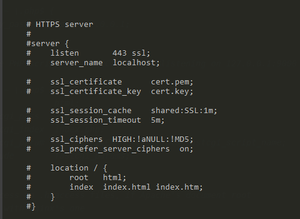

# 使用nginx配置https服务

### 一、https的原理
	1. 客户端将它所支持的算法列表和一个用作产生密钥的随机数发送给服务器；
	2. 服务器从算法列表中选择一种加密算法，并将它和一份包含服务器公用密钥的证书发送给客户端；该证书还包含了用于认证目的的服务器标识，服务器同时还提供了一个用作产生密钥的随机数；
	3. 客户端对服务器的证书进行验证（有关验证证书，可以参考数字签名），并抽取服务器的公用密钥；然后，再产生一个称作pre_master_secret的随机密码串，并使用服务器的公用密钥对其进行加密（参考非对称加/解密），并将加密后的信息发送给服务器；
	4. 客户端与服务器端根据pre_master_secret以及客户端与服务器的随机数值独立计算出加密和MAC密钥（参考DH密钥交换算法）；
	5. 客户端将所有握手消息的MAC值发送给服务器；
	6. 服务器将所有握手消息的MAC值发送给客户端。
生产环境配置https服务的话，理想方式是申请一个ssl证书，可以获得安全认证。

下文记录的是如何配置一个未认证的https服务共临时使用。需要手动生成自己的证书和私钥并添加到配置中。

### 二、nginx中关于https部分的默认配置如下图所示



### 三、使用openssl生成证书

 1. 生成key文件

    > test.key中的test可以是任何名称，这里需要输入两次密码，密码长度在 4 - 1023之间

    ```shell
    $ openssl genrsa -des3 -out test.key 1024
    Generating RSA private key, 1024 bit long modulus (2 primes)
    ..........+++++
    ......................................................................+++++
    e is 65537 (0x010001)
    Enter pass phrase for test.key:
    Verifying - Enter pass phrase for test.key:
    ```

    

 2. 生成csr文件

    > 这里需要先输入上一步设置的密码，然后再填写一些信息

    ```shell
    $ openssl req -new -key test.key -out test.csr                             
    Enter pass phrase for test.key:                                            
    You are about to be asked to enter information that will be incorporated   
    into your certificate request.                                             
    What you are about to enter is what is called a Distinguished Name or a DN.
    There are quite a few fields but you can leave some blank                  
    For some fields there will be a default value,                             
    If you enter '.', the field will be left blank.                            
    -----                                                                      
    Country Name (2 letter code) [AU]:aa                                       
    State or Province Name (full name) [Some-State]:bb                         
    Locality Name (eg, city) []:cc                                             
    Organization Name (eg, company) [Internet Widgits Pty Ltd]:dd              
    Organizational Unit Name (eg, section) []:ee                               
    Common Name (e.g. server FQDN or YOUR name) []:ff                          
    Email Address []:gg
    
    Please enter the following 'extra' attributes                              
    to be sent with your certificate request                                   
    A challenge password []:hh                                                 
    string is too short, it needs to be at least 4 bytes long                  
    A challenge password []:hhhh                                               
    An optional company name []:ii                                             
    ```

 3. 生成RSA密钥

    > 这里也需要输入第一步设置的密码,生成的test_rsa.key就是私钥，未加密的私钥

    ```shell
    $ openssl rsa -in test.key -out test_rsa.key
    Enter pass phrase for test.key:
    writing RSA key
    ```

4. 导出crt证书文件

   ```shell
   $ openssl x509 -req -days 365 -in test.csr -signkey test_rsa.key -out test.crt
   Signature ok
   subject=C = aa, ST = bb, L = cc, O = dd, OU = ee, CN = ff, emailAddress = gg
   Getting Private key
   ```

   > 最终需要的文件是`test.crt`和`test_rsa.key`

### 四、修改Nginx的配置

 1. 把`test.crt`和`test_rsa.key`这两个文件都拷贝到conf文件夹下

 2. 在`nginx.conf`中关于https部分的配置默认是注释掉的，把注释解开，把证书文件配置到对应位置即可：

    ```shell
        # HTTPS server
        #
        server {
            listen       443 ssl;
            server_name  localhost;
    
            ssl_certificate      test.crt;
            ssl_certificate_key  test_rsa.key;
    
            ssl_session_cache    shared:SSL:1m;
            ssl_session_timeout  5m;
    
            ssl_ciphers  HIGH:!aNULL:!MD5;
            ssl_prefer_server_ciphers  on;
    
            location / {
                root   html;
                index  index.html index.htm;
            }
        }
    ```
    
3. 重启Nginx即可。

