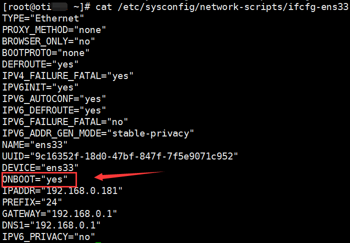
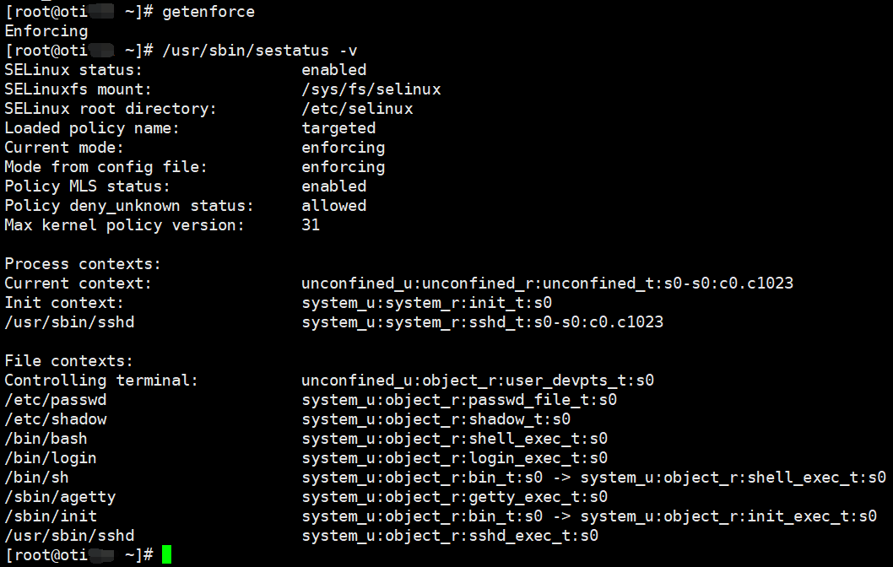
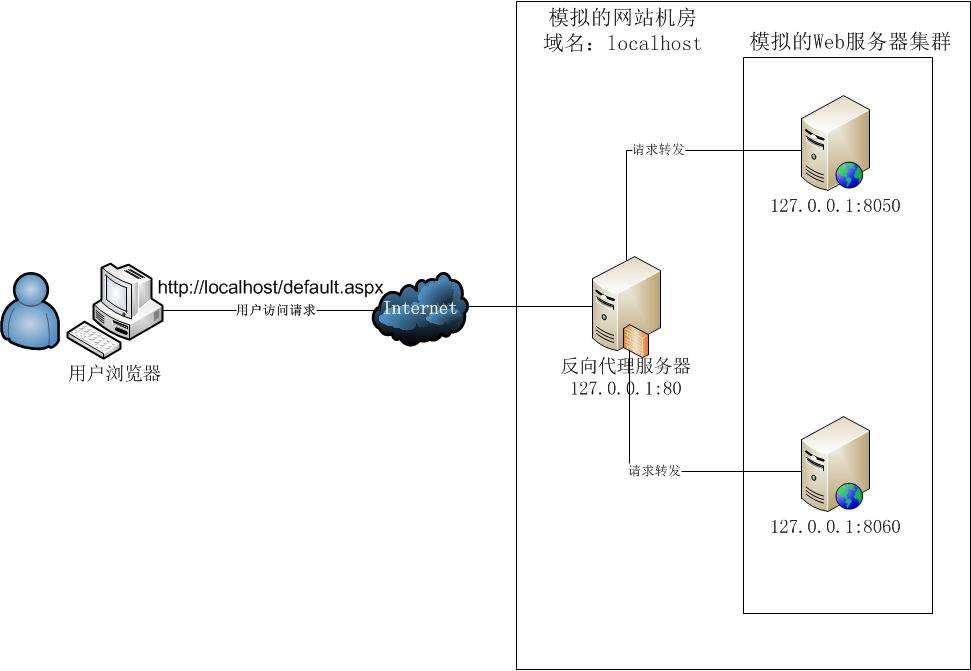

# Nginx系统介绍

## 1. nginx应用场景

- 静态资源服务器
- 反向代理服务
- API接口服务(Lua&Javascript)


## 2. nginx优势

- 高并发高性能
- 可扩展性好
- 高可靠性
- 热布署
- 开源许可证

## 3. 使用CentOS7 操作系统学习时环境的注意事项

### 3.1 启用网卡

	vi /etc/sysconfig/network-scripts/ifcfg-ens33
	ONBOOT=yes 是否随网络服务启动，ens33生效



### 3.2 关闭防火墙 

| 功能           | 命令                                |
| :------------- | :---------------------------------- |
| 停止防火墙     | systemctl stop firewalld.service    |
| 永久关闭防火墙 | systemctl disable firewalld.service |

```
# 设置防火墙永久开放8080端口
firewall-cmd --zone=public --add-port=8080/tcp --permanent
# 新开放端口后需要重启firewall
systemctl reload firewalld.service
# 查看已开放的端口
firewall-cmd --zone=public --list-ports
```


### 3.3 确认停用SELinux

   > 安全增强型 Linux（Security-Enhanced Linux）简称 SELinux，它是一个 Linux 内核模块，也是 Linux 的一个安全子系统。
   >
   > SELinux 主要作用就是最大限度地减小系统中服务进程可访问的资源（最小权限原则）。

| 功能     | 命令                                                         |
| :------- | :----------------------------------------------------------- |
| 检查状态 | getenforce                                                   |
| 检查状态 | /usr/sbin/sestatus -v                                        |
| 临时关闭 | setenforce 0                                                 |
| 永久关闭 | /etc/selinux/config SELINUX=`enforcing` 改为SELINUX=`disabled` |



### 3.4 安装依赖模块

> yum  -y install gcc gcc-c++ autoconf pcre pcre-devel make automake
>
> yum  -y install wget httpd-tools vim

| 软件包      | 描述                                                         |
| :---------- | :----------------------------------------------------------- |
| gcc         | gcc是指整个gcc的这一套工具集合，它分为gcc前端和gcc后端（我个人理解为gcc外壳和gcc引擎），gcc前端对应各种特定语言（如c++/go等）的处理（对c++/go等特定语言进行对应的语法检查, 将c++/go等语言的代码转化为c代码等），gcc后端对应把前端的c代码转为跟你的电脑硬件相关的汇编或机器码 |
| gcc-c++     | 而就软件程序包而言，gcc.rpm就是那个gcc后端，而gcc-c++.rpm就是针对c++这个特定语言的gcc前端 |
| autoconf    | autoconf是一个软件包，以适应多种Unix类系统的shell脚本的工具  |
| pcre        | PCRE(Perl Compatible Regular Expressions)是一个Perl库，包括 perl 兼容的正则表达式库 |
| pcre-devel  | devel 包主要是供开发用,包含头文件和链接库                    |
| make        | 常指一条计算机指令，是在安装有GNU Make的计算机上的可执行指令。该指令是读入一个名为makefile的文件，然后执行这个文件中指定的指令 |
| automake    | automake可以用来帮助我们自动地生成符合自由软件惯例的Makefile |
| wget        | wget 是一个从网络上自动下载文件的自由工具，支持通过 HTTP、HTTPS、FTP 三个最常见的 TCP/IP协议 下载，并可以使用 HTTP 代理 |
| httpd-tools | apace压力测试                                                |
| vim         | Vim是一个类似于Vi的著名的功能强大、高度可定制的文本编辑器    |

## 4. nginx的架构

### 4.1 轻量

- 源代码只包含核心模块
- 其它非核心功能都是通过模块实现，可以自由选择

### 4.2 架构

​	Nginx 采用的是多进程(单线程)和多路IO复用模型。

#### 4.2.1 工作流程

1. Nginx 在启动后，会有一个 `master` 进程和多个相互独立的 `worker` 进程。
2. 接收来自外界的信号,向各`worker`进程发送信号,每个进程都有可能来处理这个连接。
3. master 进程能监控 worker 进程的运行状态，当 worker 进程退出后(异常情况下)，会自动启动新的 worker 进程。


   > - worker 进程数，一般会设置成机器 cpu 核数。因为更多的worker 数，只会导致进程相互竞争 cpu，从而带来不必要的上下文切换
- 使用多进程模式，不仅能提高并发率，而且进程之间相互独立，一个 worker 进程挂了不会影响到其他 worker 进程

#### 4.2.2 IO多路复用

​	多个文件描述符的IO操作都能在一个线程里并发交替顺序完成，复用线程。

​	

#### 4.2.3 CPU亲和

​	把CPU内核和nginx的工作进程绑定在一起，让每个worker进程固定在一个CPU上执行，从而减少CPU的切换并提高缓存命中率，提高性能。

#### 4.2.4 sendfile

​	sendfile 零拷贝传输模式

​	

## 5. nginx安装

### 5.1 版本分类

- Mainline version 开发版
- Stable version 稳定版
- Legacy versions 历史版本

### 5.2 下载地址

- [nginx](http://nginx.org/en/download.html)
- [linux_packages](http://nginx.org/en/linux_packages.html#stable)

### 5.3 CentOS下YUM安装

vi /etc/yum.repos.d/nginx.repo

```txt
[nginx-stable]
name=nginx stable repo
baseurl=http://nginx.org/packages/centos/$releasever/$basearch/
gpgcheck=1
enabled=1
gpgkey=https://nginx.org/keys/nginx_signing.key
module_hotfixes=true

[nginx-mainline]
name=nginx mainline repo
baseurl=http://nginx.org/packages/mainline/centos/$releasever/$basearch/
gpgcheck=1
enabled=0
gpgkey=https://nginx.org/keys/nginx_signing.key
module_hotfixes=true
```

```shell
yum install nginx -y 安装nginx
nginx -v 查看安装的版本
nginx -V 查看编译时的参数
```

## 6. 目录

### 6.1 安装目录

查看nginx安装的配置文件和目录

```shell
rpm -ql nginx
```
> rpm -qi 包名 查看一个包的详细信息
rpm -qf 文件名 查看一个文件是由哪个包安装的
rpm -ql 包名 查看一个包安装了哪些文件
rpm -qa 查看系统中安装了哪些包

### 6.2 日志切割文件

​	logrotate用来管理linux日志文件，它可以实现日志的自动滚动，日志归档等功能。

> 配置文件路径：/etc/logrotate.d/nginx

```conf
# cat /etc/logrotate.d/nginx
/var/log/nginx/*.log {
        daily				# 日志文件每天进行滚动。其它可用值为monthly，weekly或者yearly。
        missingok			# 在日志轮循期间，任何错误将被忽略，例如 “文件无法找到” 之类的错误。
        rotate 52			# 保留最52次滚动的归档日志。对于第53个归档，时间最久的归档将被删除。
        compress			# 在轮循任务完成后，已轮循的归档将使用 gzip 进行压缩。
        delaycompress		# 总是与 compress 选项一起用，delaycompress 选项指示 logrotate 不要将最近的归档压缩，压缩 将在下一次轮循周期进行。这在你或任何软件仍然需要读取最新归档时很有用。
        notifempty			# 日志文件为空不进行滚动。
        create 640 nginx adm # 以指定的权限创建全新的日志文件，同时 logrotate 也会重命名原始日志文件。
        sharedscripts		# 运行postrotate脚本。
        postrotate
                if [ -f /var/run/nginx.pid ]; then
                        kill -USR1 `cat /var/run/nginx.pid`
                fi
        endscript
}
```


```command line
# ls /var/log/nginx
access.log  error.log  error.log-20201206
```

> 扩展阅读 - [Linux日志切割神器logrotate原理介绍和配置详解](https://zhuanlan.zhihu.com/p/90507023)

### 6.3 主配置文件

| 路径                           | 用途                   |
| :----------------------------- | :--------------------- |
| /etc/nginx/nginx.conf          | 核心配置文件           |
| /etc/nginx/conf.d/default.conf | 默认http服务器配置文件 |

### 6.4 cgi配置

- CGI是common gateway interface(通用网关接口)
- Web Server 通过cgi协议可以把动态的请求传递给如php、jsp、python和perl等应用程序
- FastCGI 实际上是增加了一些扩展功能的 CGI ,是 CGI 的改进，描述了客户端和Web服务器程序之间传输数据的一种标准。
- SCGI协议是一个CGI（通用网关接口）协议的替代品· 它是一个应用与HTTP服务器的接口标准，类似于FastCGI,但是它设计得更为容易实现
- uwsgi是一个Web服务器，它实现了WSGI协议、uwsgi、http等协议


| 路径                      | 用途        |
| :------------------------ | :---------- |
| /etc/nginx/fastcgi_params | fastcgi配置 |
| /etc/nginx/scgi_params    | scgi配置    |
| /etc/nginx/uwsgi_params   | uwsgi配置   |

### 6.5 编码转换映射转化文件

| 路径               | 用途                      |
| :----------------- | :------------------------ |
| /etc/nginx/koi-utf | koi8-r <--> utf-8         |
| /etc/nginx/koi-win | koi8-r <--> windows-1251  |
| /etc/nginx/win-utf | windows-1251 < -- > utf-8 |

- 这三个文件都是与编码转换映射文件，用于在输出内容到客户端时，将一种编码转换到另一种编码
- `koi8-r`是斯拉夫文字8位元编码，供俄语及保加利亚语使用。在Unicode未流行之前，KOI8-R 是最为广泛使用的俄语编码，使用率甚至起ISO/IEC 8859-5还高。这3个文件存在是因为作者是俄国人的原因。

### 6.6 扩展名文件

/etc/nginx/mime.types

| 路径     | 用途                  |                                            |
| :------- | :-------------------- | ------------------------------------------ |
| 配置文件 | /etc/nginx/mime.types | 设置http协议的Content-Type与扩展名对应关系 |

### 6.7 守护进程管理

- 用于配置系统守护进程管理器管理方式

| 路径                                        | 用途 |
| :------------------------------------------ | :--- |
| /usr/lib/systemd/system/nginx-debug.service |      |
| /usr/lib/systemd/system/nginx.service       |      |
| /etc/sysconfig/nginx                        |      |
| /etc/sysconfig/nginx-debug                  |      |

```shell
systemctl restart nginx.service
```

### 6.8 nginx模块目录

- nginx安装的模块

| 路径               | 用途                      |
| :----------------- | :------------------------ |
| /etc/nginx/modules | 最基本的共享库和内核模块, |

目的是存放用于启动系统和执行root文件系统的命令的如`/bin`和`/sbin`的二进制文件的共享库，或者存放32位，或者64位(file命令查看)| | /usr/lib64/nginx/modules |64位共享库|

### 6.9 文档

- nginx的手册和帮助文件

| 路径                                  | 用途     |
| :------------------------------------ | :------- |
| /usr/share/doc/nginx-1.14.2           | 帮助文档 |
| /usr/share/doc/nginx-1.14.0/COPYRIGHT | 版权声明 |
| /usr/share/man/man8/nginx.8.gz        | 手册     |

### 6.10 缓存目录

| 路径             | 用途            |
| :--------------- | :-------------- |
| /var/cache/nginx | nginx的缓存目录 |

### 6.11 日志目录

| 路径           | 用途            |
| :------------- | :-------------- |
| /var/log/nginx | nginx的日志目录 |

### 6.12 可执行命令

- nginx服务的启动管理的可执行文件

| 路径                  | 用途               |
| :-------------------- | :----------------- |
| /usr/sbin/nginx       | 可执行命令         |
| /usr/sbin/nginx-debug | 调试执行可执行命令 |

## 7. 编译参数

### 7.1 安装目录和路径

```conf
--prefix=/etc/nginx #安装目录
--sbin-path=/usr/sbin/nginx #可执行文件
--modules-path=/usr/lib64/nginx/modules #安装模块
--conf-path=/etc/nginx/nginx.conf  #配置文件路径
--error-log-path=/var/log/nginx/error.log  #错误日志
--http-log-path=/var/log/nginx/access.log  #访问日志
--pid-path=/var/run/nginx.pid #进程ID
--lock-path=/var/run/nginx.lock #加锁对象
```

### 7.2 临时性文件

- 执行对应模块时nginx所保留的临时性文件

```conf
--http-client-body-temp-path=/var/cache/nginx/client_temp #客户端请求体临时路径
--http-proxy-temp-path=/var/cache/nginx/proxy_temp #代理临时路径
--http-fastcgi-temp-path=/var/cache/nginx/fastcgi_temp 
--http-uwsgi-temp-path=/var/cache/nginx/uwsgi_temp 
--http-scgi-temp-path=/var/cache/nginx/scgi_temp 
```

### 7.3 指定用户

- 设置nginx进程启动的用户和用户组

```conf
--user=nginx   #指定用户
--group=nginx  #指定用户组
```

### 7.4 设置额外参数

- 设置额外的参数将被添加到`CFLAGS`变量
- `CFLAGS`变量用来存放C语言编译时的优化参数

```conf
--with-cc-opt='-O2 -g -pipe -Wall -Wp,-D_FORTIFY_SOURCE=2 -fexceptions -fstack-protector-strong 
```

### 7.5 设置链接文件参数

- 定义要传递到C链接器命令行的其他选项
- PCRE库，需要指定–with-ld-opt="-L /usr/local/lib"

```conf
--with-ld-opt='-Wl,-z,relro -Wl,-z,now -pie'
```

### 7.6 其它参数

```conf
--with-compat 
--with-file-aio 
--with-threads 
--with-http_addition_module 
--with-http_auth_request_module 
--with-http_dav_module 
--with-http_flv_module 
--with-http_gunzip_module 
--with-http_gzip_static_module 
--with-http_mp4_module 
--with-http_random_index_module 
--with-http_realip_module 
--with-http_secure_link_module 
--with-http_slice_module 
--with-http_ssl_module 
--with-http_stub_status_module 
--with-http_sub_module 
--with-http_v2_module 
--with-mail 
--with-mail_ssl_module 
--with-stream 
--with-stream_realip_module 
--with-stream_ssl_module 
--with-stream_ssl_preread_module 
--param=ssp-buffer-size=4 -grecord-gcc-switches -m64 -mtune=generic -fPIC' 
```

> [编译安装nginx的echo模块](./echo-nginx-module.md)

## 8. 配置文件

- /etc/nginx/nginx.conf #主配置文件
- /etc/nginx/conf.d/*.conf #包含conf.d目录下面的所有配置文件
- /etc/nginx/conf.d/default.conf

### 8.1 nginx配置语法

```conf
# 使用#可以添加注释,使用$符号可以使用变量
# 配置文件由指令与指令块组成,指令块以{}将多条指令组织在一起
http {
# include语句允许把多个配置文件组合起来以提升可维护性    
    include       mime.types;
# 每条指令以;(分号)结尾，指令与参数之间以空格分隔
    default_type  application/octet-stream;
    sendfile        on;
    keepalive_timeout  65;
    server {
        listen       80;
        server_name  localhost;
# 有些指令可以支持正则表达式        
        location / {
            root   html;
            index  index.html index.htm;
        }
        error_page   500 502 503 504  /50x.html;
        location = /50x.html {
            root   html;
        }
    }
}
```

### 8.2 全局配置

| 分类 | 配置项           | 作用                         |
| :--- | :--------------- | :--------------------------- |
| 全局 | user             | 设置nginx服务的系统使用用户  |
| 全局 | worker_processes | 工作进程数,一般和CPU数量相同 |
| 全局 | error_log        | nginx的错误日志              |
| 全局 | pid              | nginx服务启动时的pid         |

### 8.3 事件配置

| 分类   | 配置项             | 作用                                                         |
| :----- | :----------------- | :----------------------------------------------------------- |
| events | worker_connections | 每个进程允许的最大连接数 10000                               |
| events | use                | 指定使用哪种模型(select/poll/epoll),建议让nginx自动选择,linux内核2.6以上一般能使用epoll可以提高性能 |

### 8.4 http配置

- /etc/nginx/nginx.conf
- 一个HTTP下面可以配置多个server

```conf
user  nginx;   设置nginx服务的系统使用用户  
worker_processes  1;  工作进程数,一般和CPU数量相同 

error_log  /var/log/nginx/error.log warn;   nginx的错误日志  
pid        /var/run/nginx.pid;   nginx服务启动时的pid

events {
    worker_connections  1024;每个进程允许的最大连接数 10000
}

http {
    include       /etc/nginx/mime.types;//文件后缀和类型类型的对应关系
    default_type  application/octet-stream;//默认content-type

    log_format  main  '$remote_addr - $remote_user [$time_local] "$request" '
                      '$status $body_bytes_sent "$http_referer" '
                      '"$http_user_agent" "$http_x_forwarded_for"';  //日志记录格式

    access_log  /var/log/nginx/access.log  main;//默认访问日志

    sendfile        on;//启用sendfile
    #tcp_nopush     on;//懒发送

    keepalive_timeout  65;//超时时间是65秒

    #gzip  on; # 启用gzip压缩

    include /etc/nginx/conf.d/*.conf;//包含的子配置文件
}
```

### 8.5 server

- /etc/nginx/conf.d/default.conf
- 一个server下面可以配置多个`location`

```conf
server {
    listen       80;  //监听的端口号
    server_name  localhost;  //用域名方式访问的地址

    #charset koi8-r; //编码
    #access_log  /var/log/nginx/host.access.log  main;  //访问日志文件和名称

    location / {
        root   /usr/share/nginx/html;  //静态文件根目录
        index  index.html index.htm;  //首页的索引文件
    }

    #error_page  404              /404.html;  //指定错误页面

    # redirect server error pages to the static page /50x.html
    # 把后台错误重定向到静态的50x.html页面
    error_page   500 502 503 504  /50x.html; 
    location = /50x.html {
        root   /usr/share/nginx/html;
    }

    # proxy the PHP scripts to Apache listening on 127.0.0.1:80
    # 代理PHP脚本到80端口上的apache服务器
    #location ~ \.php$ {
    #    proxy_pass   http://127.0.0.1;
    #}

    # pass the PHP scripts to FastCGI server listening on 127.0.0.1:9000
    # 把PHP脚本9000端口上监听的FastCGI服务
    #location ~ \.php$ {
    #    root           html;
    #    fastcgi_pass   127.0.0.1:9000;
    #    fastcgi_index  index.php;
    #    fastcgi_param  SCRIPT_FILENAME  /scripts$fastcgi_script_name;
    #    include        fastcgi_params;
    #}

    # deny access to .htaccess files, if Apache's document root
    # concurs with nginx's one
    # 不允许访问.htaccess文件
    #location ~ /\.ht {
    #    deny  all;
    #}
}
```

### 8.6 Systemd

- 系统启动和服务器守护进程管理器，负责在系统启动或运行时，激活系统资源，服务器进程和其他进程，根据管理，字母d是守护进程（daemon）的缩写

#### 8.6.1 配置目录

| 配置目录                | 用途                                                         |
| :---------------------- | :----------------------------------------------------------- |
| /usr/lib/systemd/system | 每个服务最主要的启动脚本设置，类似于之前的/etc/initd.d       |
| /run/system/system      | 系统执行过程中所产生的服务脚本，比上面的目录优先运行         |
| /etc/system/system      | 管理员建立的执行脚本，类似于/etc/rc.d/rcN.d/Sxx类的功能，比上面目录优先运行，在三者之中，此目录优先级最高 |

#### 8.6.2 systemctl

- 监视和控制systemd的主要命令是systemctl
- 该命令可用于查看系统状态和管理系统及服务

```command line
命令：systemctl  command name.service
启动：service name start –>systemctl start name.service
停止：service name stop –>systemctl stop name.service
重启：service name restart–>systemctl restart name.service
状态：service name status–>systemctl status name.service
```

### 8.7 启动和重新加载

```command line
systemctl restart nginx.service
systemctl reload nginx.service
nginx -s reload
```

### 8.8 Linux系统中查找正在运行的nginx目录

1. 查看nginx的PID，以18851端口为例：

    ```shell
    netstat -anop | grep 0.0.0.0:80
    ```

    

2. 通过相应的进程ID(36607）查询当前运行的nginx路径：

    ```shell
    ll /proc/36607/exe
    ```

    

3. 获取到nginx的执行路径后(/opt/nginx/sbin/nginx)，使用-t参数即可获取该进程对应的配置文件路径，如：

    ```shell
    /opt/nginx/sbin/nginx -t
    ```
    

### 8.9 日志类型

- curl -v [http://localhost](http://localhost/)

#### 8.9.1 日志类型

- /var/log/nginx/access.log 访问日志
- /var/log/nginx/error.log 错误日志

#### 8.9.2 log_format

| 类型    | 用法                                          |
| :------ | :-------------------------------------------- |
| 语法    | log_format name [escape=default[json] string] |
| 默认    | log_format combined " "                       |
| Context | http                                          |

##### 8.9.2.1 内置变量

[ngx_http_log_module](http://nginx.org/en/docs/http/ngx_http_log_module.html) [log_format](http://nginx.org/en/docs/http/ngx_http_log_module.html#log_format)

| 名称             | 含义                     |
| :--------------- | :----------------------- |
| $remote_addr     | 客户端地址               |
| $remote_user     | 客户端用户名称           |
| $time_local      | 访问时间和时区           |
| $request         | 请求行                   |
| $status          | HTTP请求状态             |
| $body_bytes_sent | 发送给客户端文件内容大小 |

##### 8.9.2.2 HTTP请求变量

- 注意要把`-`转成下划线,比如`User-Agent`对应于`$http_user_agent`

| 名称             | 含义     | 例子                                                         |
| :--------------- | :------- | :----------------------------------------------------------- |
| arg_PARAMETER    | 请求参数 | $arg_name                                                    |
| http_HEADER      | 请求头   | $http_referer $http_host $http_user_agent $http_x_forwarded_for(代理过程) |
| sent_http_HEADER | 响应头   | sent_http_cookie                                             |

> IP1->IP2(代理)->IP3 会记录IP地址的代理过程
>
> - http_x_forwarded_for=Client IP,Proxy(1) IP,Proxy(2) IP

#### 8.9.3 示例

```conf
 # 定义一种日志格式 
 log_format  main  '$remote_addr - $remote_user [$time_local] "$request" '
                      '$status $body_bytes_sent "$http_referer" '
                      '"$http_user_agent" "$http_x_forwarded_for"';

 log_format  zfpx  '$arg_name $http_referer sent_http_date"';
 # 指定写入的文件名和日志格式
 access_log  /var/log/nginx/access.log  main;    
tail -f /var/log/nginx/access.log

221.216.143.110 - - [09/Jun/2018:22:41:18 +0800] "GET / HTTP/1.1" 200 612 "-" "Mozilla/5.0 (Windows NT 6.1; Win64; x64) AppleWebKit/537.36 (KHTML, like Gecko) Chrome/62.0.3202.94 Safari/537.36" "-"
```

## 9. 核心模块

### 9.1 监控nginx客户端的状态

#### 9.1.1 模块名

- --with-http_stub_status_module 监控nginx客户端的状态

#### 9.1.2 语法

```conf
Syntax: stub_status on/off;
Default: -
Context: server->location
```

#### 9.1.3 实战

/etc/nginx/conf.d/default.conf

```diff
server {
+    location /status{
+       stub_status  on;
+    }

systemctl reload nginx.service

http://192.171.207.104/status

Active connections: 2            
server accepts handled requests  
 3 3 10 
Reading: 0 Writing: 1 Waiting: 1 
```

| 参数               | 含义                                                         |
| :----------------- | :----------------------------------------------------------- |
| Active connections | 当前nginx正在处理的活动连接数                                |
| accepts            | 总共处理的连接数                                             |
| handled            | 成功创建握手数                                               |
| requests           | 总共处理请求数                                               |
| Reading            | 读取到客户端的Header信息数                                   |
| Writing            | 返回给客户端的Header信息数                                   |
| Waiting            | 开启keep-alive的情况下,这个值等于 active – (reading + writing) |

### 9.2 随机主页

#### 9.2.1 模块名

- --with-http_random_index_module 在根目录里随机选择一个主页显示

#### 9.2.2 语法

```conf
Syntax: random_index on/off;
Default: off
Context: location
```

#### 9.2.3 实战

/etc/nginx/conf.d/default.conf

```diff
+    location / {
+       root /opt/app;
+       random_index on;
+    }
```

### 9.3 内容替换

#### 9.3.1 模块名

- --with-http_sub_module 内容替换

#### 9.3.2 语法

##### 9.3.2.1 文本替换

```conf
Syntax: sub_filter string replacement;
Default: --
Context: http,service,location
```

##### 9.3.2.2 只匹配一次

```conf
Syntax: sub_filter_once on|off;
Default: off
Context: http,service,location
```

#### 9.3.3 实战

/etc/nginx/conf.d/default.conf

```diff
location / {
        root   /usr/share/nginx/html;
        index  index.html index.htm;
+        sub_filter 'world' 'zhufeng';
+        sub_filter_once off;
    }
```

### 9.4 请求限制

#### 9.4.1 模块名

- --with-limit_conn_module 连接频率限制
- --with-limit_req_module 请求频率限制
- 一次TCP请求至少产生一个HTTP请求
- SYN > SYN,ACK->ACK->REQUEST->RESPONSE->FIN->ACK->FIN->ACK

#### 9.4.2 ab

- Apache的ab命令模拟多线程并发请求，测试服务器负载压力，也可以测试nginx、lighthttp、IIS等其它Web服务器的压力
  - -n 总共的请求数
  - -c 并发的请求数

```conf
ab -n 40 -c 20 http://127.0.0.1/
```

#### 9.4.3 请求限制

##### 9.4.3.1 语法

limit_req_zone

```conf
# 可以以IP为key zone为空间的名称 size为申请空间的大小
Syntax: limit_req_zone key zone=name:size rate=rate;   
Default: --
Context: http(定义在server以外)
```

limit_req

```conf
# zone名称 number限制的数量
Syntax: limit_req  zone=name [burst=number] [nodelay];
Default: --
Context: http,server,location
```

##### 9.4.3.2 案例

```conf
limit_req_zone $binary_remote_addr zone=req_zone:1m rate=1r/s;
server {
  location /{
      limit_req req_zone;
      # 缓存区队列burst=3个,不延期，即每秒最多可处理rate+burst个.同时处理rate个
      limit_req zone=req_zone burst=3 nodelay;
  }
}
```

- $binary_remote_addr 表示远程的IP地址
- zone=req_zone:10m 表示一个内存区域大小为10m,并且设定了名称为`req_zone`
- rate=1r/s 表示请求的速率是1秒1个请求
- zone=req_zone 表示这个参数对应的全局设置就是req_zone的那个内存区域
- burst=3 表示请求队列的长度
- nodelay 表示不延时

#### 9.4.4 连接限制

##### 9.4.4.1 语法

limit_conn_zone

```conf
# 可以以IP为key zone为空间的名称 size为申请空间的大小
Syntax: limit_conn_zone key zone=name:size;   
Default: --
Context: http(定义在server以外)
```

limit_conn

```conf
# zone名称 number限制的数量
Syntax: limit_conn  zone number;
Default: --
Context: http,server,location
```

##### 9.4.4.2 案例

```conf
limit_conn_zone $binanry_remote_addr zone=conn_zone:1m;
server {
  location /{
      limit_conn conn_zone 1;
  }
}
```

- 表明以ip为key，来限制每个ip访问文件时候，最多只能有一个在线，否则其余的都要返回不可用

### 9.5 访问控制

- 基于IP的访问控制 -http_access_module
- 基于用户的信任登录 -http_auth_basic_module

#### 9.5.1 http_access_module

```conf
Syntax: allow address|all;
Default: --
Context: http,server,location,limit_except
Syntax: deny address|CIDR|all;
Default: --
Context: http,server,location,limit_except
server {
+ location ~ ^/admin.html{
+      deny 192.171.207.100;
+      allow all;
+    }
}    
server {
+ location ~ ^/admin.html{
+    if ($http_x_forwarded_for !~* "^8\.8\.8\.8") {
+       return 403;
+    }
}    
```

| 符号 | 含义                                                         |
| :--- | :----------------------------------------------------------- |
| =    | 严格匹配。如果这个查询匹配，那么将停止搜索并立即处理此请求。 |
| ~    | 为区分大小写匹配(可用正则表达式)                             |
| !~   | 为区分大小写不匹配                                           |
| ~*   | 为不区分大小写匹配(可用正则表达式)                           |
| !~*  | 为不区分大小写不匹配                                         |
| ^~   | 如果把这个前缀用于一个常规字符串,那么告诉nginx 如果路径匹配那么不测试正则表达式。 |

#### 9.5.2 http_auth_basic_module

```conf
Syntax: auth_basic string|off;
Default: auth_basic off;
Context: http,server,location,limit_except
Syntax: auth_basic_user_file file;
Default: -;
Context: http,server,location,limit_except
htpasswd -c /etc/nginx/users.conf zhangsan
server {
+    auth_basic '请登录';
+    auth_basic_user_file /etc/nginx/users.conf;
```

## 10 静态资源Web服务

### 10.1 静态和动态资源

- 静态资源：一般客户端发送请求到web服务器，web服务器从内存在取到相应的文件，返回给客户端，客户端解析并渲染显示出来。
- 动态资源：一般客户端请求的动态资源，先将请求交于web容器，web容器连接数据库，数据库处理数据之后，将内容交给web服务器，web服务器返回给客户端解析渲染处理。

| 类型       | 种类           |
| :--------- | :------------- |
| 浏览器渲染 | HTML、CSS、JS  |
| 图片       | JPEG、GIF、PNG |
| 视频       | FLV、MPEG      |
| 下载文件   | Word、Excel    |

### 10.2 CDN

- CDN的全称是Content Delivery Network，即内容分发网络。
- CDN系统能够实时地根据网络流量和各节点的连接、负载状况以及到用户的距离和响应时间等综合信息将用户的请求重新导向离用户最近的服务节点上。其目的是使用户可就近取得所需内容，解决 Internet网络拥挤的状况，提高用户访问网站的响应速度。


### 10.3 配置语法

#### 10.3.1 sendfile

- 不经过用户内核发送文件

| 类型   | 种类                                |
| :----- | :---------------------------------- |
| 语法   | sendfile on / off                   |
| 默认   | sendfile off;                       |
| 上下文 | http,server,location,if in location |

#### 10.3.2 tcp_nopush

- 在sendfile开启的情况下，合并多个数据包，提高网络包的传输效率

| 类型   | 种类                 |
| :----- | :------------------- |
| 语法   | tcp_nopush on / off  |
| 默认   | tcp_nopush off;      |
| 上下文 | http,server,location |

#### 10.3.3 tcp_nodelay

- 在keepalive连接下，提高网络包的传输实时性

| 类型   | 种类                 |
| :----- | :------------------- |
| 语法   | tcp_nodelay on / off |
| 默认   | tcp_nodelay on;      |
| 上下文 | http,server,location |

#### 10.3.4 gzip

- 压缩文件可以节约带宽和提高网络传输效率

| 类型   | 种类                 |
| :----- | :------------------- |
| 语法   | gzip on / off        |
| 默认   | gzip off;            |
| 上下文 | http,server,location |

#### 10.3.5 gzip_comp_level

- 压缩比率越高，文件被压缩的体积越小

| 类型   | 种类                  |
| :----- | :-------------------- |
| 语法   | gzip_comp_level level |
| 默认   | gzip_comp_level 1;    |
| 上下文 | http,server,location  |

#### 10.3.6 gzip_http_version

- 压缩版本

| 类型   | 种类                      |
| :----- | :------------------------ |
| 语法   | gzip_http_version 1.0/1.1 |
| 默认   | gzip_http_version 1.1;    |
| 上下文 | http,server,location      |

#### 10.3.7 http_gzip-static_module

- 先找磁盘上找同名的`.gz`这个文件是否存在,节约CPU的压缩时间和性能损耗
- http_gzip_static_module 预计gzip模块
- http_gunzip_module 应用支持gunzip的压缩方式

| 类型   | 种类                 |
| :----- | :------------------- |
| 语法   | gzip_static on/off   |
| 默认   | gzip_static off;     |
| 上下文 | http,server,location |

#### 10.3.8 案例

```conf
gzip index.txt
```

/etc/nginx/conf.d/default.conf

```nginx.conf
    location ~ .*\.(jpg|png|gif)$ {
        gzip off;#关闭压缩
        root /data/www/images;
    }

    location ~ .*\.(html|js|css)$ {
        gzip on; #启用压缩
        gzip_min_length 1k;    #只压缩超过1K的文件
        gzip_http_version 1.1; #启用gzip压缩所需的HTTP最低版本
        gzip_comp_level 9;     #压缩级别，压缩比率越高，文件被压缩的体积越小
        gzip_types  text/css application/javascript;#进行压缩的文件类型
        root /data/www/html;
    }

    location ~ ^/download {
        gzip_static on; #启用压缩
        tcp_nopush on;  # 不要着急发，攒一波再发
        root /data/www; # 注意此处目录是`/data/www`而不是`/data/www/download`
    } 
```

## 11. 浏览器缓存

- 校验本地缓存是否过期

  

| 类型          | 种类                            |
| :------------ | :------------------------------ |
| 检验是否过期  | Expires、Cache-Control(max-age) |
| Etag          | Etag                            |
| Last-Modified | Last-Modified                   |

### 11.1 expires

- 添加Cache-Control、Expires头

| 类型   | 种类                 |
| :----- | :------------------- |
| 语法   | expires time         |
| 默认   | expires off;         |
| 上下文 | http,server,location |

```conf
location ~ .*\.(jpg|png|gif)$ {
    expires 24h;
}
```

## 12. 跨域

- 跨域是指一个域下的文档或脚本试图去请求另一个域下的资源

| 类型   | 种类                  |
| :----- | :-------------------- |
| 语法   | add_header name value |
| 默认   | add_header --;        |
| 上下文 | http,server,location  |

```conf
https://github.com/creationix/nvm
location ~ .*\.json$ {
        add_header Access-Control-Allow-Origin http://localhost:3000;
        add_header Access-Control-Allow-Methods GET,POST,PUT,DELETE,OPTIONS;
        root /data/json;
}

let xhr = new XMLHttpRequest();
        xhr.open('GET', 'http://47.104.184.134/users.json', true);
        xhr.onreadystatechange = function () {
            if (xhr.readyState == 4 && xhr.status == 200) {
                console.log(xhr.responseText);
            }
        }
xhr.send();
```

## 13. 防盗链

- 防止网站资源被盗用
- 保证信息安全
- 防止流量过量
- 需要区别哪些请求是非正常的用户请求
- 使用`http_refer`防盗链

| 类型   | 种类                                         |
| :----- | :------------------------------------------- |
| 语法   | valid_referers none、block、server_names、IP |
| 默认   | -                                            |
| 上下文 | server,location                              |

```diff
location ~ .*\.(jpg|png|gif)$ {
        expires 1h;
        gzip off;
        gzip_http_version 1.1;
        gzip_comp_level 3;
        gzip_types image/jpeg image/png image/gif;
        # none没有refer blocked非正式HTTP请求 特定IP
+       valid_referers none blocked 47.104.184.134;
+       if ($invalid_referer) { # 验证通过为0，不通过为1
+           return 403;
+       }
        root /data/images;
    }
-e, --referer       Referer URL (H)
curl -e "http://www.baidu.com" http://192.171.207.104/girl.jpg
curl -e "192.171.207.100" http://192.171.207.104/girl.jpg
```

## 14. 代理服务

### 14.1 配置

| 类型   | 种类            |
| :----- | :-------------- |
| 语法   | proxy_pass URL  |
| 默认   | -               |
| 上下文 | server,location |

### 14.2 正向代理

- 正向代理的对象是客户端,服务器端看不到真正的客户端

- 通过公司代理服务器上网

  

C:\Windows\System32\drivers\etc

```conf
192.168.20.150 www.zhufengpeixun.cn
```
```conf
resolver 8.8.8.8; #谷歌的域名解析地址
location / {
    # $http_host 要访问的主机名 $request_uri请求路径
    proxy_pass http://$http_host$request_uri;
}
```

- 按`Win+R`系统热键打开`运行`窗口，输入`ipconfig /flushdns`命令后按回车，就可以清空电脑的DNS缓存

### 14.3 反向代理

- 反向代理的对象的服务端,客户端看不到真正的服务端
- nginx代理应用服务器



```conf
location ~ ^/api {
    proxy_pass http://localhost:3000;
    proxy_redirect default; #重定向

    proxy_set_header Host $http_host;        #向后传递头信息
    proxy_set_header X-Real-IP $remote_addr; #把真实IP传给应用服务器

    proxy_connect_timeout 30; #默认超时时间
    proxy_send_timeout 60;    # 发送超时
    proxy_read_timeout 60;    # 读取超时


    proxy_buffering on;             # 在proxy_buffering 开启的情况下，Nginx将会尽可能的读取所有的upstream端传输的数据到buffer，直到proxy_buffers设置的所有buffer们 被写满或者数据被读取完(EOF)
    proxy_buffers 4 128k;           # proxy_buffers由缓冲区数量和缓冲区大小组成的。总的大小为number*size
    proxy_busy_buffers_size 256k;   # proxy_busy_buffers_size不是独立的空间，他是proxy_buffers和proxy_buffer_size的一部分。nginx会在没有完全读完后端响应的时候就开始向客户端传送数据，所以它会划出一部分缓冲区来专门向客户端传送数据(这部分的大小是由proxy_busy_buffers_size来控制的，建议为proxy_buffers中单个缓冲区大小的2倍)，然后它继续从后端取数据，缓冲区满了之后就写到磁盘的临时文件中。
    proxy_buffer_size 32k;          # 用来存储upstream端response的header
    proxy_max_temp_file_size 256k; # response的内容很大的 话，Nginx会接收并把他们写入到temp_file里去，大小由proxy_max_temp_file_size控制。如果busy的buffer 传输完了会从temp_file里面接着读数据，直到传输完毕。
}
```
```shell
curl http://localhost/api/users.json
```

## 15 负载均衡


- 使用集群是网站解决高并发、海量数据问题的常用手段。
- 当一台服务器的处理能力、存储空间不足时，不要企图去换更强大的服务器，对大型网站而言，不管多么强大的服务器，都满足不了网站持续增长的业务需求。
- 这种情况下，更恰当的做法是增加一台服务器分担原有服务器的访问及存储压力。通过负载均衡调度服务器，将来自浏览器的访问请求分发到应用服务器集群中的任何一台服务器上，如果有更多的用户，就在集群中加入更多的应用服务器，使应用服务器的负载压力不再成为整个网站的瓶颈。

### 15.1 upstream

- nginx把请求转发到后台的一组`upstream`服务池

| 类型   | 种类             |
| :----- | :--------------- |
| 语法   | upstream name {} |
| 默认   | -                |
| 上下文 | http             |

```conf
var http = require( 'http' );
var server =http.createServer( function ( request ,response ){
          response.end('server3 000');
} );
server.listen( 3000 ,function(){
console.log( 'HTTP服务器启动中，端口：3000' );
});
upstream zhufeng {
  server 127.0.0.1:3000 weight=10;
  server 127.0.0.1:4000;
  server 127.0.0.1:5000;
}

server {
    location / {
        proxy_pass http://zhufeng;
    }
```

### 15.2 后端服务器调试状态

| 状态         | 描述                                                         |
| :----------- | :----------------------------------------------------------- |
| down         | 当前的服务器不参与负载均衡                                   |
| backup       | 当其它节点都无法使用时的备份的服务器                         |
| max_fails    | 允许请求失败的次数,到达最大次数就会休眠                      |
| fail_timeout | 经过max_fails失败后，服务暂停的时间,默认10秒                 |
| max_conns    | 限制每个server最大的接收的连接数,性能高的服务器可以连接数多一些 |

```conf
upstream zfpx {
  server localhost:3000 down;
  server localhost:4000 backup;
  server localhost:5000 max_fails=1 fail_timeout=10s;
}
```

### 15.3 分配方式

| 类型             | 种类                                                         |
| :--------------- | :----------------------------------------------------------- |
| 轮询(默认)       | 每个请求按时间顺序逐一分配到不同的后端服务器，如果后端服务器down掉，能自动剔除 |
| weight(加权轮询) | 指定轮询几率，weight和访问比率成正比，用于后端服务器性能不均的情况 |
| ip_hash          | 每个请求按访问ip的hash结果分配，这样每个访客固定访问一个后端服务器，可以解决session的问题 |
| least_conn       | 哪个机器上连接数少就分发给谁                                 |
| url_hash(第三方) | 按访问的URL地址来分配 请求，每个URL都定向到同一个后端 服务器上(缓存) |
| fair(第三方)     | 按后端服务器的响应时间来分配请求，响应时间短的优先分配       |
| 正定义hash       | hash自定义key                                                |

```conf
upstream zhufeng{
  ip_hash;
  server 127.0.0.1:3000;
}
upstream zhufeng{
  least_conn;
  server 127.0.0.1:3000;
}
upstream zhufeng{
  url_hash;
  server 127.0.0.1:3000;
}
upstream zhufeng{
  fair;
  server 127.0.0.1:3000;
}
upstream zhufeng{
  hash $request_uri;
  server 127.0.0.1:3000;
}
```

## 16. 缓存

- 应用服务器端缓存
- 代理缓存
- 客户端缓存


```conf
http{  
    # 缓存路径 目录层级 缓存空间名称和大小 失效时间为7天 最大容量为10g
    proxy_cache_path /data/nginx/cache levels=1:2 keys_zone=cache:100m inactive=60m max_size=10g;  
}  
```

| 键值             | 含义                                                       |
| :--------------- | :--------------------------------------------------------- |
| proxy_cache_path | 缓存文件路径                                               |
| levels           | 设置缓存文件目录层次；levels=1:2 表示两级目录              |
| keys_zone        | 设置缓存名字和共享内存大小                                 |
| inactive         | 在指定时间内没人访问则被删除                               |
| max_size         | 最大缓存空间，如果缓存空间满，默认覆盖掉缓存时间最长的资源 |

```conf
    if ($request_uri ~ ^/cache/(login|logout)) {
      set $nocache 1;
    }
    location / {
       proxy_pass http://zhufeng;
    }
    location ~ ^/cache/ {
     proxy_cache cache;
     proxy_cache_valid  200 206 304 301 302 60m;   # 对哪些状态码缓存，过期时间为60分钟
     proxy_cache_key $uri;  #缓存的维度
     proxy_no_cache $nocache;
     proxy_set_header Host $host:$server_port;  #设置头
     proxy_set_header X-Real-IP $remote_addr;   #设置头
     proxy_set_header   X-Forwarded-For $proxy_add_x_forwarded_for;   #设置头
     proxy_pass http://127.0.0.1:6000;
    }
```

| 键值                                       | 含义                                          |
| :----------------------------------------- | :-------------------------------------------- |
| proxy_cache                                | 使用名为cache的对应缓存配置                   |
| proxy_cache_valid 200 206 304 301 302 10d; | 对httpcode为200的缓存10天                     |
| proxy_cache_key $uri                       | 定义缓存唯一key,通过唯一key来进行hash存取     |
| proxy_set_header                           | 自定义http header头，用于发送给后端真实服务器 |
| proxy_pass                                 | 指代理后转发的路径，注意是否需要最后的/       |

## 17. rewrite

- 可以实现url重写及重定向

### 17.1 用途

- URL页面跳转
- 兼容旧版本
- SEO优化(伪静态)
- 维护(后台维护、流量转发)
- 安全(伪静态)

### 17.2 语法

| 类型   | 种类                             |
| :----- | :------------------------------- |
| 语法   | rewrite regex replacement [flag] |
| 默认   | -                                |
| 上下文 | server,location,if               |

- regex 正则表达式指的是要被改写的路径
- replacement 目标要替换成哪个URL
- flag 标识

实例

```conf
rewrite ^(.*)$ /www/reparing.html break;
```

### 17.3 正则表达式

| 类型  | 种类                                       |
| :---- | :----------------------------------------- |
| .     | 匹配除换行符之外的任意字符                 |
| ?     | 重复0次或1次                               |
| +     | 重复1次或更多次                            |
| *     | 重复零次或多次                             |
| ^     | 匹配字符串的开始                           |
| $     | 匹配字符串的结束                           |
| {n}   | 重复n次                                    |
| {n,}  | 重复n次或更多次                            |
| [abc] | 匹配单个字符a或者b或者c                    |
| a-z   | 匹配a-z小写字母的任意一个                  |
| \     | 转义字符                                   |
| ()    | 用于匹配括号之间的内容，可以通过$1、$2引用 |

```conf
rewrite index\.php$ /pages/repare.html break;
if($http_user_agent ~ MSIE){
  rewrite ^(.*)$ /msie/$1 break;
}
```

pcretest

```conf
wget https://ftp.pcre.org/pub/pcre/pcre-8.13.tar.gz
tar -xzvf  pcre-8.13.tar.gz
cd pcre-8.13
./configure --enable-utf8  
make
make install
pcretest
```

### 17.4 flag

- 标志位是标识规则对应的类型

| flag      | 含义                                                         |
| :-------- | :----------------------------------------------------------- |
| last      | 先匹配自己的location,然后通过rewrite规则新建一个请求再次请求服务端 |
| break     | 先匹配自己的location,然后生命周期会在当前的location结束,不再进行后续的匹配 |
| redirect  | 返回302昨时重定向,以后还会请求这个服务器                     |
| permanent | 返回301永久重定向,以后会直接请求永久重定向后的域名           |

```conf
 location ~ ^/break {
     rewrite ^/break /test break;
     proxy_pass http://127.0.0.1:3000;
}

location ~ ^/last {
      rewrite ^/last /test last;
}

location /test {
      default_type application/json;
      return 200 '{"code":0,"msg":"success"}';
}

curl -vL http://192.168.20.150/redirect

location ~ ^/redirect {
 rewrite ^/redirect http://www.baidu.com redirect;
 rewrite ^/redirect http://www.baidu.com permanent;
}
```

- 先执行server中的rewrite指令
- 执行location匹配
- 再执行location中的rewrite

### 17.5 rewrite优先级

- 先执行server中的rewrite指令
- 执行location匹配
- 再执行location中的rewrite

### 17.6 location中的优先级

- 等号类型（=）的优先级最高。一旦匹配成功，则不再查找其他匹配项。
- ^~类型表达式。一旦匹配成功，则不再查找其他匹配项。
- 正则表达式类型（~ ~*）的优先级次之。如果有多个location的正则能匹配的话，则使用正则表达式最长的那个。
- 常规字符串匹配类型按前缀匹配

## 20. 附录

### 20.1 用户空间和内核空间

- 现在操作系统都采用虚拟寻址，处理器先产生一个虚拟地址，通过地址翻译成物理地址（内存的地址），再通过总线的传递，最后处理器拿到某个物理地址返回的字节。
- 对32位操作系统而言，它的寻址空间（虚拟存储空间）为4G（2的32次方）。操作系统的核心是内核，独立于普通的应用程序，可以访问受保护的内存空间，也有访问底层硬件设备的所有权限。为了保证用户进程不能直接操作内核（kernel），保证内核的安全，操心系统将虚拟空间划分为两部分，一部分为内核空间，一部分为用户空间
- 针对linux操作系统而言，将最高的1G字节（从虚拟地址0xC0000000到0xFFFFFFFF），供内核使用，称为内核空间，而将较低的3G字节（从虚拟地址0x00000000到0xBFFFFFFF），供各个进程使用，称为用户空间。
- 地址空间就是一个非负整数地址的有序集合。如{0,1,2...}。

### 20.2 进程上下文切换(进程切换)

- 为了控制进程的执行，内核必须有能力挂起正在CPU上运行的进程，并恢复以前挂起的某个进程的执行。这种行为被称为进程切换
- 从一个进程的运行转到另一个进程上运行，这个过程中经过下面这些变化：
  - 1. 保存当前进程A的上下文,上下文就是内核再次唤醒当前进程时所需要的状态，由一些对象的值组成 　- 2. 恢复成进程B的上下文 ....
  - 1. 恢复成进程A的上下文

### 20.3 进程的阻塞

- 正在执行的进程，由于期待的某些事件未发生，将自己的运行状态变成阻塞状态
- 进程的阻塞是进程自身的一种主动行为，也因此只有处于运行态的进程（获得CPU），才可能将其转为阻塞状态。当进程进入阻塞状态，是不占用CPU资源的

### 20.4 文件描述符

- 文件描述符(File descriptor)是一个用于表述指向文件的引用的抽象化概念
- 当程序打开一个现有文件或者创建一个新文件时，内核向进程返回一个文件描述符

### 20.5 I/O模式

- 对于一次IO访问(以read举例),数据会先被拷贝到操作系统内核的缓冲区中，然后才会从操作系统内核的缓冲区拷贝到应用程序的缓冲区，最后交给进程。所以说，当一个read操作发生时，它会经历两个阶段：
  - 1. 等待数据准备
  - 1. 将数据从内核拷贝到进程中

### 20.6 分类

- 同步阻塞IO
- 同步非阻塞IO
- 异步阻塞IO(IO多路复用)
- 异步非阻塞IO

### 20.7 事件模型

- 目前支持I/O多路复用的系统调用有 select、poll和epoll
- I/O多路复用就是通过一种机制,一个进程可以监视多个描述符,一旦某个描述符就绪(一般是读就绪或者写就绪),能够通知程序进行相应的读写操作
- 但select、poll和epoll本质上都是同步I/O，因为他们都需要在读写事件就绪后自己负责进行读写，也就是说这个读写过程是阻塞的

| 事件模型 | 描述                                                         |
| :------- | :----------------------------------------------------------- |
| select   | 单个进程能打开的最大连接数为1024,因为需要对所有的文件描述符进行线性遍历，所以文件描述符太多会导致性能下降。 |
| poll     | 和select基本一样，因为用链表存储文件描述符,没有最大连接数限制 |
| epoll    | epoll是在每个文件描述符上设置callback来实现，FD就绪后才会调用callback,活跃socket少的话性能高，socket活跃多的话性能低 |
