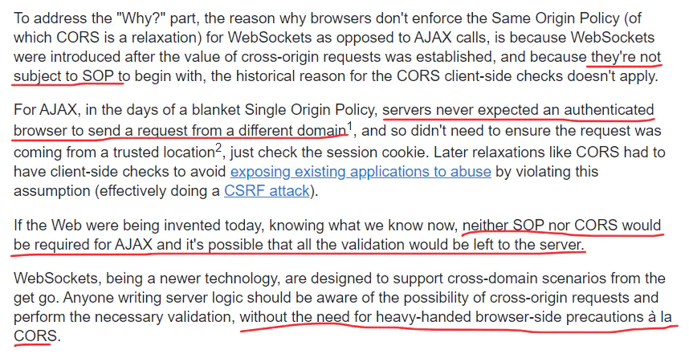

面试前复习WebSocket时注意到了很多开发时没有想到过的知识点，其中一个就是**WebSocket协议可以用来跨域**，奇怪的是，明明AJAX和WebSocket都属于**跨域读**，按理来说应该都受同源策略的限制，为啥WebSocket就不受他的限制呢？在网上查了一番资料，发现有人这样解释道：

image.png

------

原来WebSocket根本不附属于同源策略，而且它本身就有意被设计成可以跨域的一个手段。由于历史原因，跨域检测一直是由浏览器端来做，但是WebSocket出现以后，对于WebSocket的跨域检测工作就交给了服务端，浏览器仍然会带上一个`Origin`跨域请求头，服务端则根据这个请求头判断此次跨域WebSocket请求是否合法

作者：HonmaMeiko__
链接：https://www.jianshu.com/p/9a8d793ec52a
来源：简书
著作权归作者所有。商业转载请联系作者获得授权，非商业转载请注明出处。